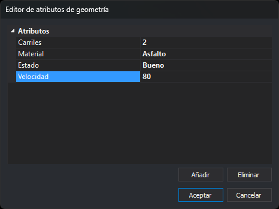
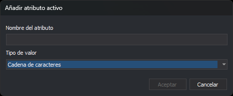

# EDITAR\_ATRIBUTOS
<!-- id: editar-atributos -->

Edita los atributos de la entidad seleccionada.

## Parámetros

No admite parámetros.

## Observaciones

La orden muestra el mensaje «Selecciona la geometría para editar sus atributos», solicita que selecciones una entidad del archivo de dibujo activo y muestra el cuadro de diálogo **Editor de atributos de geometría** con los atributos de esa entidad. La orden edita una sola entidad cada vez. No admite selección múltiple.

Los atributos son pares nombre-valor que guarda la propia entidad, los mismos que asigna el panel [Atributos activos](../../../paneles/atributos-activos.md). Los atributos de la base de datos enlazada con los códigos de la entidad se editan con la orden [EDITAR\_COD](editar-cod.md).

Al aceptar el cuadro de diálogo:

* Si los atributos han cambiado, la orden sustituye la entidad por una copia con los atributos editados. La copia se añade al final del archivo de dibujo y la entidad original se borra. Si la copia no se puede añadir, o la original no se puede borrar, la entidad no cambia y suena el aviso de error.
* Si los atributos no han cambiado, la entidad no se modifica.

La orden [UNDO](../u/undo.md) deshace la sustitución.

Al cerrar el cuadro de diálogo, Digi3D.AI emite un pitido y la orden termina.

## Cuadro de diálogo Editor de atributos de geometría

* **Atributos**: lista de atributos de la entidad. Cada fila muestra el nombre del atributo y su valor. Haz clic en un valor para cambiarlo. Los valores cambiados se muestran en negrita.
* **Añadir**: abre el cuadro de diálogo **Añadir atributo activo** para añadir un atributo a la entidad.
* **Eliminar**: quita de la entidad el atributo seleccionado. Si no hay ningún atributo seleccionado, no hace nada.
* **Aceptar**: aplica los cambios a la entidad.
* **Cancelar**: cierra el cuadro de diálogo sin cambiar la entidad.

Al escribir un valor:

* Los números con decimales se escriben con punto (`12.5`), sea cual sea la configuración regional de Windows. Un valor numérico con coma da un error de conversión.
* Las fechas se escriben con el formato de la configuración regional de Windows.
* Si el valor no se puede convertir al tipo del atributo, Digi3D.AI muestra un mensaje de error y el atributo conserva el valor anterior.
* Si borras el valor, el atributo queda sin valor (NULL). Lo que se escriba después en un atributo sin valor se guarda como cadena de caracteres.

El nombre de un atributo no se puede cambiar. Para cambiarlo, elimina el atributo y añade otro con el nombre nuevo.

## Cuadro de diálogo Añadir atributo activo

Lo abre el botón **Añadir** del editor de atributos. Añade el atributo a la entidad, no a la lista de atributos activos. A diferencia del cuadro de diálogo del mismo nombre del panel Atributos activos, no tiene el campo **Valor automático**.

* **Nombre del atributo**: nombre del atributo. Distingue mayúsculas de minúsculas. Si la entidad ya tiene un atributo con ese nombre, el cuadro de diálogo se cierra sin añadir el atributo y sin mostrar ningún aviso.
* **Tipo de valor**: tipo de dato del atributo: cadena de caracteres, entero con o sin signo de 8, 16, 32 o 64 bits, coma flotante de precisión simple o doble, o fecha. Al abrir el cuadro de diálogo está seleccionado **Cadena de caracteres**. El atributo se añade al final de la lista con un valor vacío o cero, que se cambia después en el editor.
* **Aceptar**: añade el atributo. Está desactivado mientras el nombre esté vacío.
* **Cancelar**: cierra el cuadro de diálogo sin añadir el atributo.

## Características de la orden

| Tipo de orden                                    | [Orden interactiva](/digi3d-ai/referencia/ventana-de-dibujo/ordenes-interactivas.md) |
| ------------------------------------------------ | ------------------------------------------------------------------------------------ |
| Repite automáticamente                           | Sí |
| Opción del menú donde aparece la orden           | _Editar/Editar atributos de una entidad..._ |
| Barra de herramientas en la que aparece la orden | _Esta orden no tiene asociado ningún botón en ninguna barra de herramientas_ |
| Extensión                                        | DigiNG.OrdenesStandard.dll |
| Variables relacionadas                           | [REPITE](/digi3d-ai/referencia/ventana-de-dibujo/variables/r/repite.md) — repite la última orden ejecutada |
| Órdenes relacionadas                             | [CAMB\_ATRIBUTOS](/digi3d-ai/referencia/ventana-de-dibujo/ordenes/c/camb_atributos.md) [CLONAR\_ATRIBUTOS](/digi3d-ai/referencia/ventana-de-dibujo/ordenes/c/clonar_atributos.md) [EDITAR\_COD](/digi3d-ai/referencia/ventana-de-dibujo/ordenes/e/editar-cod.md) [LISTA\_ATRIBUTOS](/digi3d-ai/referencia/ventana-de-dibujo/ordenes/l/lista_atributos.md) |
| Nombre interno                                   | {C3B968CE-2D7C-4D4D-890F-950700FA1EE2} |
