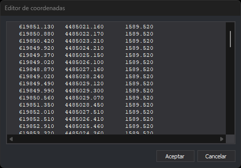

# EDITOR
<!-- id: editor -->

Permite editar en un cuadro de texto las coordenadas de los vértices de la línea que se seleccione.

## Parámetros

No admite parámetros.

## Observaciones

Al ejecutar la orden, la barra de estado muestra el mensaje «Selecciona línea a editar». La orden solo admite líneas del archivo de dibujo actual; si se selecciona otro tipo de geometría, emite un sonido de error y sigue esperando la selección.

Al seleccionar la línea, la orden muestra el cuadro de diálogo **Editor de coordenadas**, con un cuadro de texto en fuente de ancho fijo que contiene una línea por vértice con sus coordenadas X, Y y Z. Cada coordenada ocupa 13 caracteres y se escribe con el número de decimales que fija la variable [NDEC](/digi3d-ai/referencia/ventana-de-dibujo/variables/n/ndec.md).

En el cuadro de texto se pueden modificar las coordenadas, añadir líneas para añadir vértices y borrar líneas para eliminarlos. Al pulsar **Aceptar**, el cuadro de diálogo comprueba cada línea:

* Las líneas vacías se ignoran.
* Cada línea tiene que contener tres números, X Y Z, separados por espacios, tabuladores, comas o puntos y comas, con el punto como separador decimal.
* Si una línea no cumple estas condiciones, se muestra un mensaje con su número, se selecciona la línea y el cuadro de diálogo sigue abierto para corregirla.
* Una línea con los mismos números que tenía al abrir el cuadro de diálogo conserva las coordenadas originales del vértice con todos sus decimales, aunque en pantalla se muestren redondeadas.

Si las coordenadas no cambian, la orden no modifica la línea. Si cambian, la orden borra la línea original y añade una línea nueva con los mismos códigos y atributos y con los vértices del cuadro de texto. Si se borran todas las líneas del cuadro de texto, la orden borra la línea. La modificación se puede deshacer con la orden [UNDO](/digi3d-ai/referencia/ventana-de-dibujo/ordenes/u/undo.md).

Si la línea original no se puede borrar (por ejemplo, porque una extensión lo impide) o la línea nueva no se puede añadir, el archivo de dibujo queda como estaba y la orden emite un sonido de error.

Al pulsar **Cancelar**, la orden termina sin modificar la línea.

## Características de la orden

| Tipo de orden | [Orden interactiva](/digi3d-ai/referencia/ventana-de-dibujo/ordenes-interactivas.md) |
| :--- | :--- |
| Repite automáticamente | No |
| Opción del menú donde aparece la orden | Editar/Editar las coordenadas de una geometría... |
| Barra de herramientas en la que aparece la orden | _Esta orden no tiene asociado ningún botón en ninguna barra de herramientas_ |
| Extensión | DigiNG.OrdenesStandard.dll |
| Variables relacionadas | [NDEC](/digi3d-ai/referencia/ventana-de-dibujo/variables/n/ndec.md) — número de decimales de las coordenadas |
| Órdenes relacionadas | [EDITAR\_XYZ](/digi3d-ai/referencia/ventana-de-dibujo/ordenes/e/editar-xyz.md) |
| Nombre interno | {B826AC47-F6A5-4D4B-8FE5-1DCDE8DA0FB1} |
