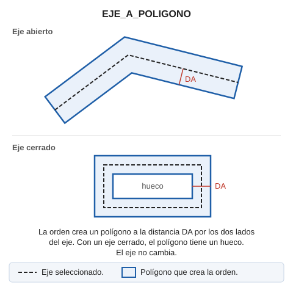

# EJE\_A\_POLIGONO
<!-- id: eje-a-poligono -->

Dibuja un polígono que rodea a una línea existente.

## Parámetros

| Número de parámetro | Descripción | Opcional |
| :--- | :--- | :--- |
| 1 | Código | Si |

## Observaciones

El polígono rodea la línea a la misma distancia por los dos lados. Si la línea es cerrada, el resultado es un polígono con un hueco.

* Sin parámetros, selecciona la línea y escribe la distancia en la barra de estado o mídela digitalizando dos puntos. Si la variable [REPITE](/digi3d-ai/referencia/ventana-de-dibujo/variables/r/repite.md) está activa, la orden vuelve a pedir otra línea.
* Con un código, la orden procesa todas las líneas visibles de ese código y termina. La distancia es la distancia activa principal de [DA](/digi3d-ai/referencia/ventana-de-dibujo/variables/d/da.md), y la distancia activa secundaria se suma a la Z de todos los vértices del polígono.

## Características de la orden

| Tipo de orden | [Orden interactiva](eje-a-poligono.md) |
| :--- | :--- |
| Repite automáticamente | No |
| Opción del menú donde aparece la orden | Dibujar/Más/Eje a polígono |
| Barra de herramientas en la que aparece la orden | _Esta orden no tiene asociado ningún botón en ninguna barra de herramientas_ |
| Extensión | DigiNG.OrdenesStandard.dll |
| Variables relacionadas | [DA](/digi3d-ai/referencia/ventana-de-dibujo/variables/d/da.md) — distancia activa [REPITE](/digi3d-ai/referencia/ventana-de-dibujo/variables/r/repite.md) — repite la última orden ejecutada |
| Órdenes relacionadas | No tiene órdenes relacionadas |
| Nombre interno | {359C0C96-AD11-4819-85E6-60F70DBA6640} |
