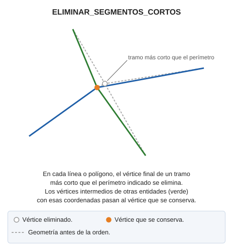
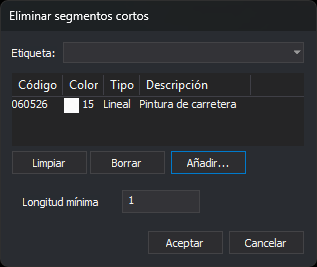

# ELIMINAR\_SEGMENTOS\_CORTOS
<!-- id: eliminar-segmentos-cortos -->

Elimina vértices de las líneas y los polígonos de los códigos indicados para que no tengan tramos más cortos que una longitud mínima. Los vértices de otras entidades que coinciden con un vértice eliminado se mueven al vértice que se conserva. Para localizar esos tramos sin modificar el dibujo, usa [DETECTAR\_SEGMENTOS\_CORTOS](/digi3d-ai/referencia/ventana-de-dibujo/ordenes/d/detectar-segmentos-cortos.md).

## Parámetros

| Número de parámetro | Descripción | Opcional |
| :--- | :--- | :--- |
| 1 | Longitud mínima de un tramo. Tiene que ser un número mayor que 0. | Sí |
| 2 y siguientes | Códigos de las entidades. Admite comodines (`*`, `?`) y etiquetas de la tabla de códigos con `#` (por ejemplo, `#vias_de_comunicacion`). | Sí |

### Ejemplos

`ELIMINAR_SEGMENTOS_CORTOS`

Abre un cuadro de diálogo para elegir los códigos y la longitud mínima.

`ELIMINAR_SEGMENTOS_CORTOS=0.5 060526`

Elimina vértices de las entidades con el código `060526` hasta que ningún tramo mida menos de 0,5 unidades.

## Cuadro de diálogo

Si ejecutas la orden sin parámetros, o solo con la longitud, aparece el cuadro de diálogo [Selecciona códigos](/digi3d-ai/referencia/cuadros-de-dialogo/selecciona-codigos.md) con el título _Eliminar segmentos cortos_. Si solo indicas la longitud, la orden no la usa: el cuadro muestra la que tiene guardada.

Debajo de la lista de códigos, el cuadro tiene un campo propio:

| Campo | Descripción | Valor por defecto |
| :--- | :--- | :--- |
| Longitud mínima | Longitud mínima de un tramo, medida en planta. Tiene que ser un número mayor que 0 | La última longitud aceptada; 1 la primera vez |

El botón _Aceptar_ solo está habilitado si la lista contiene al menos un código y la longitud mínima es un número mayor que 0. Al pulsar _Aceptar_, la orden guarda la longitud en el valor `LongitudMinima` de la clave del registro `HKEY_CURRENT_USER\Software\Digi21\Digi3D.NET\DigiNG\Extensiones\DigiNG.OrdenesTopologia\DetectarSegmentosCortos`, el mismo que usa DETECTAR\_SEGMENTOS\_CORTOS. La lista de códigos no se guarda.

Si pulsas _Cancelar_, la orden termina sin modificar nada.

## Observaciones

### Entidades que se corrigen

La orden corrige las líneas y los polígonos del archivo de dibujo activo que no están borrados, están visibles y están dentro de la zona de interés, y que tienen alguno de los códigos indicados. Una entidad se corrige si alguno de sus tramos, en el contorno o en un hueco, mide menos que la longitud mínima. La longitud se mide en planta, entre vértices consecutivos, igual que en DETECTAR\_SEGMENTOS\_CORTOS. Un tramo de longitud igual a la mínima no es corto.

Si el sistema de referencia de coordenadas de la ventana de dibujo es proyectado \(UTM, Lambert, etc.\) o local, la longitud está en las unidades de las coordenadas. Si es geográfico, la orden proyecta cada contorno y cada hueco en una proyección estereográfica oblicua con origen en su primer vértice, y la longitud está en metros.

### Vértices que se eliminan

La orden recorre los vértices de cada línea, de cada contorno y de cada hueco desde el primero:

* El primer vértice se conserva siempre.
* Cada vértice siguiente se conserva si su distancia en planta al último vértice conservado es igual o mayor que la longitud mínima. Si no, se elimina.
* El último vértice se conserva siempre. Si está a menos de la longitud mínima del último vértice conservado, se elimina ese vértice anterior en su lugar, salvo que sea el primero.

Por eso una línea conserva siempre al menos dos vértices, y puede quedar con un tramo corto entre el primero y el último. Un polígono muy pequeño, o un triángulo con un lado corto, puede quedar con menos de tres vértices distintos.

### Vértices de otras entidades

Cada vértice eliminado se asocia con el último vértice conservado antes de él, o con el último vértice de la entidad si se ha eliminado el anterior a este. Después, la orden busca en las líneas y los polígonos del archivo de dibujo activo, de cualquier código y aunque no estén visibles, los vértices cuyas coordenadas X e Y coinciden exactamente con las de un vértice eliminado. Les asigna la X y la Y del vértice conservado, mantiene su Z y elimina los vértices duplicados que resulten. Si la entidad corregida conserva ese mismo punto en otra posición, los vértices de las demás entidades no se mueven.

### Resultado

Cada entidad modificada se sustituye por una copia corregida. Las entidades cuyas coordenadas no cambian no se sustituyen. La orden muestra el porcentaje de avance mientras trabaja y no escribe ningún resumen. [UNDO](/digi3d-ai/referencia/ventana-de-dibujo/ordenes/u/undo.md) deshace los cambios de la orden.

Si la longitud indicada como parámetro no es un número mayor que 0, la orden muestra «La longitud mínima de los segmentos tiene que ser un número mayor que 0.», emite el sonido de error y no modifica nada.

## Características de la orden

| Tipo de orden | [Orden interactiva](/digi3d-ai/referencia/ventana-de-dibujo/ordenes-interactivas.md) sin parámetros; orden inmediata con parámetros |
| :--- | :--- |
| Repite automáticamente | No |
| Opción del menú donde aparece la orden | Análisis geométricos/Eliminar segmentos cortos... |
| Barra de herramientas en la que aparece la orden | _Esta orden no tiene asociado ningún botón en ninguna barra de herramientas_ |
| Extensión | DigiNG.OrdenesTopologia.dll |
| Variables relacionadas | No tiene variables relacionadas |
| Órdenes relacionadas | [DETECTAR\_SEGMENTOS\_CORTOS](/digi3d-ai/referencia/ventana-de-dibujo/ordenes/d/detectar-segmentos-cortos.md) [UNDO](/digi3d-ai/referencia/ventana-de-dibujo/ordenes/u/undo.md) |
| Nombre interno | {C3857680-4931-4331-AB7C-FFD14D3360E3} |
