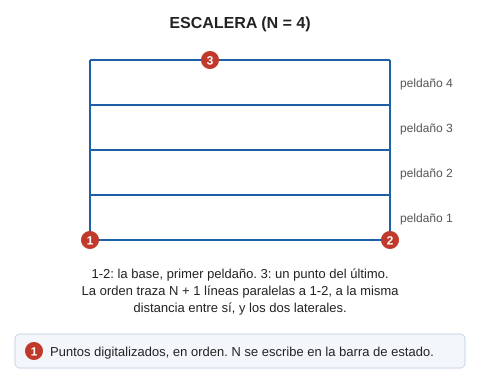

# ESCALERA

Dibuja escaleras en el espacio.

## Parámetros

No admite parámetros.

## Observaciones

Debemos introducir el número de escalones de la escalera, que serán paralelos a la base.

## Características de la orden

| Tipo de orden | [Orden interactiva](escalera.md) |
| :--- | :--- |
| Repite automáticamente | No |
| Opción del menú donde aparece la orden | Dibujar/Mas/Escalera indicando el número de peldaños |
| Barra de herramientas en la que aparece la orden | Escaleras |
| Extensión | DigiNG.OrdenesStandard.dll |
| Variables relacionadas | No tiene variables relacionadas |
| Nombre interno | {9FECD378-BB36-43dc-B635-7D114979A3DC} |

