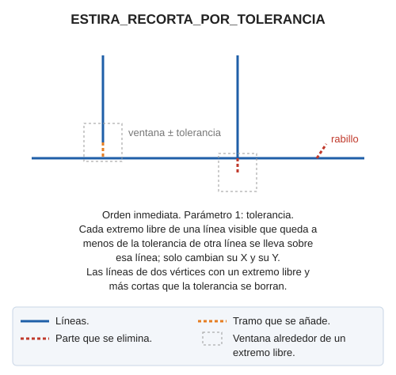

# ESTIRA\_RECORTA\_POR\_TOLERANCIA

Estira o recorta extremos de líneas visibles para que toquen a otras.

## Parámetros

| Número de parámetro | Descripción | Opcional |
| :--- | :--- | :--- |
| 1 | Tolerancia | No |

## Observaciones

La orden trabaja con las líneas visibles del archivo de referencia y con sus extremos libres, es decir, los extremos que no tocan a otra línea. Lo hace en dos fases:

1. Borra las líneas de dos vértices que tienen un extremo libre y miden en planta menos que la tolerancia.
2. Ajusta cada extremo libre que queda a menos de la tolerancia de otra línea. La orden busca en la ventana cuadrada de lado dos veces la tolerancia centrada en el extremo:
   * Si un vértice de la otra línea cae en la ventana, el extremo se lleva a ese vértice.
   * Si no, el extremo se lleva a la proyección sobre la otra línea.

   Si la línea no llega a la otra línea, se estira; si la sobrepasa, se recorta. Solo cambian la X y la Y del extremo; la Z se conserva.

## Características de la orden

| Tipo de orden | [Orden inmediata](estira-recorta-por-tolerancia.md) |
| :--- | :--- |
| Repite automáticamente | No |
| Opción del menú donde aparece la orden | _Esta orden no tiene asociada ninguna opción de menú_ |
| Barra de herramientas en la que aparece la orden | _Esta orden no tiene asociado ningún botón en ninguna barra de herramientas_ |
| Extensión | DigiNG.OrdenesTopologia.dll |
| Variables relacionadas | No tiene variables relacionadas |
| Nombre interno | {B247E248-4308-414E-B160-BE4488DB4737} |
