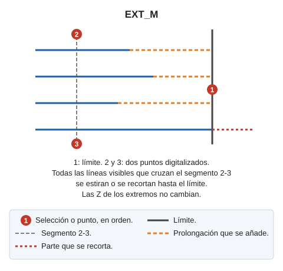

# EXT\_M
<!-- id: ext-m -->

Estira o recorta un grupo de entidades hasta que interseccionen con otra entidad dada.

## Parámetros

No admite parámetros.

## Observaciones

La orden pide primero la línea límite y después dos puntos. La orden ajusta al límite todas las líneas visibles que cortan el segmento entre los dos puntos. En cada línea prueba los dos extremos y lleva a la intersección con el límite cada extremo que la tenga:

* Si la línea no llega al límite, la orden la estira.
* Si la línea sobrepasa el límite, la orden la recorta.

Los extremos de las líneas conservan su coordenada Z original.

La orden termina después de procesar los dos puntos.

## Características de la orden

| Tipo de orden | [Orden interactiva](ext-m.md) |
| :--- | :--- |
| Repite automáticamente | Si |
| Opción del menú donde aparece la orden | Editar/Polilíneas/Extender múltiples líneas para que se crucen con otra línea \(2 puntos\) |
| Barra de herramientas en la que aparece la orden | Extender/Recortar |
| Extensión | DigiNG.OrdenesStandard.dll |
| Variables relacionadas | [REPITE](/digi3d-ai/referencia/ventana-de-dibujo/variables/r/repite.md) — repite la última orden ejecutada |
| Órdenes relacionadas | [EXT](/digi3d-ai/referencia/ventana-de-dibujo/ordenes/e/ext.md) [EXT\_P](/digi3d-ai/referencia/ventana-de-dibujo/ordenes/e/ext-p.md) [EXT\_PLANO](/digi3d-ai/referencia/ventana-de-dibujo/ordenes/e/ext-plano.md) [EXT\_XYZ](/digi3d-ai/referencia/ventana-de-dibujo/ordenes/e/ext-xyz.md) [EXT2X](/digi3d-ai/referencia/ventana-de-dibujo/ordenes/e/ext2x.md) [EXTIENDE\_EXTREMO](/digi3d-ai/referencia/ventana-de-dibujo/ordenes/e/extiende_extremo.md) [TRIM\_M](/digi3d-ai/referencia/ventana-de-dibujo/ordenes/t/trim-m.md) |
| Nombre interno | {8A015BFD-4882-4f6c-A0BE-5A1A873C2D8D} |

