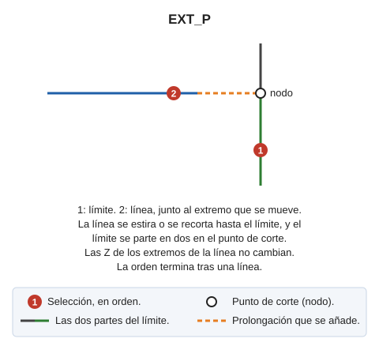

# EXT\_P

Extiende una entidad hasta su intersección con otra quedando ambas partidas en el punto de intersección, es decir, genera un nodo en este punto.

## Parámetros

No admite parámetros.

## Observaciones

La orden EXT\_P no insertará un vértice nuevo si las coordenadas de intersección con la línea a partir coincidan \(dentro del rango de una unidad de precisión\) con otro vértice existente en la línea a cortar.

## Características de la orden

| Tipo de orden | [Orden interactiva](ext-p.md) |
| :--- | :--- |
| Repite automáticamente | Si |
| Opción del menú donde aparece la orden | Editar/Polilíneas/Extender una polilínea para que se cruce con otra partiendo |
| Barra de herramientas en la que aparece la orden | Extender/Recortar |
| Extensión | DigiNG.OrdenesStandard.dll |
| Variables relacionadas | [REPITE](/digi3d-ai/referencia/ventana-de-dibujo/variables/r/repite.md) — repite la última orden ejecutada |
| Nombre interno | {F0E5BE92-BAC4-42cb-9ABE-ABBD6C14889C} |

