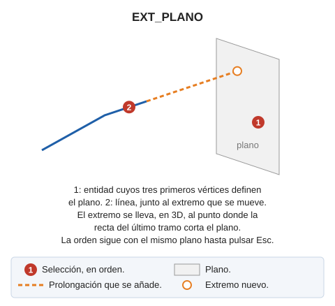

# EXT\_PLANO
<!-- id: ext-plano -->

Solicita que se seleccione un plano y a continuación solicita que se seleccione una línea. Extiende el extremo más cercano a la selección al plano.

## Parámetros

No admite parámetros.

## Características de la orden

| Tipo de orden | [Orden interactiva](ext-plano.md) |
| :--- | :--- |
| Repite automáticamente | Si |
| Opción del menú donde aparece la orden | _Esta orden no tiene asociada ninguna opción de menú_ |
| Barra de herramientas en la que aparece la orden | _Esta orden no tiene asociado ningún botón en ninguna barra de herramientas_ |
| Extensión | DigiNG.OrdenesStandard.dll |
| Variables relacionadas | [REPITE](/digi3d-ai/referencia/ventana-de-dibujo/variables/r/repite.md) — repite la última orden ejecutada |
| Órdenes relacionadas | [EXT](/digi3d-ai/referencia/ventana-de-dibujo/ordenes/e/ext.md) [EXT\_M](/digi3d-ai/referencia/ventana-de-dibujo/ordenes/e/ext-m.md) [EXT\_P](/digi3d-ai/referencia/ventana-de-dibujo/ordenes/e/ext-p.md) [EXT\_XYZ](/digi3d-ai/referencia/ventana-de-dibujo/ordenes/e/ext-xyz.md) [EXT2X](/digi3d-ai/referencia/ventana-de-dibujo/ordenes/e/ext2x.md) [EXTIENDE\_EXTREMO](/digi3d-ai/referencia/ventana-de-dibujo/ordenes/e/extiende_extremo.md) |
| Nombre interno | {D4C54539-EDFB-4397-983D-EA231076DE1D} |
