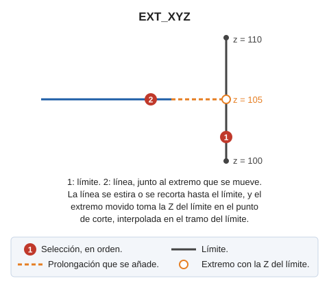

# EXT\_XYZ

Estira o recorta una entidad contra un límite haciendo que la coordenada Z del extremo ajustado coincida con la del límite.

## Parámetros

No admite parámetros.

## Observaciones

La orden pide primero la línea límite y después las líneas a ajustar. Cada línea a ajustar tiene que pertenecer al modelo actual. La orden elige el extremo a ajustar a partir del punto con el que seleccionas la línea, y lleva ese extremo a la intersección con el límite:

* Si la línea no llega al límite, la orden la estira.
* Si la línea sobrepasa el límite, la orden la recorta.

El extremo ajustado toma la Z del límite, interpolada en el segmento del límite donde cae la intersección.

La orden no termina tras ajustar una línea: sigue pidiendo líneas con el mismo límite. Al pulsar Esc, la orden descarta el límite y pide uno nuevo. Al pulsar Esc sin límite seleccionado, la orden termina.

## Características de la orden

| Tipo de orden | [Orden interactiva](ext-xyz.md) |
| :--- | :--- |
| Repite automáticamente | Si |
| Opción del menú donde aparece la orden | _Esta orden no tiene asociada ninguna opción de menú_ |
| Barra de herramientas en la que aparece la orden | _Esta orden no tiene asociado ningún botón en ninguna barra de herramientas_ |
| Extensión | DigiNG.OrdenesStandard.dll |
| Variables relacionadas | [REPITE](/digi3d-ai/referencia/ventana-de-dibujo/variables/r/repite.md) — repite la última orden ejecutada |
| Órdenes relacionadas | [EXT](/digi3d-ai/referencia/ventana-de-dibujo/ordenes/e/ext.md) [EXT\_M](/digi3d-ai/referencia/ventana-de-dibujo/ordenes/e/ext-m.md) [EXT\_P](/digi3d-ai/referencia/ventana-de-dibujo/ordenes/e/ext-p.md) [EXT\_PLANO](/digi3d-ai/referencia/ventana-de-dibujo/ordenes/e/ext-plano.md) [EXT2X](/digi3d-ai/referencia/ventana-de-dibujo/ordenes/e/ext2x.md) [EXTIENDE\_EXTREMO](/digi3d-ai/referencia/ventana-de-dibujo/ordenes/e/extiende_extremo.md) |
| Nombre interno | {ABE645BA-F678-4D83-A765-C51F852A4354} |

