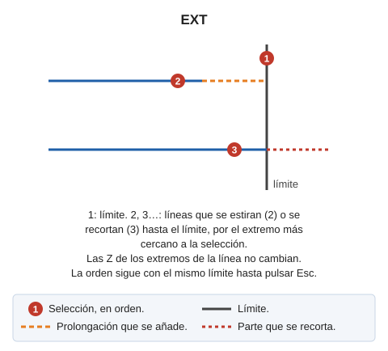

# EXT

Estira o recorta una entidad hasta el punto de intersección con otra entidad dada.

## Parámetros

No admite parámetros.

## Observaciones

La orden pide primero la línea límite. El límite puede ser una línea o un polígono; en un polígono, el límite es el contorno o el hueco que contiene el tramo seleccionado.

Después pide las líneas que se ajustan al límite. Cada línea tiene que pertenecer al modelo actual. La orden elige el extremo a ajustar a partir del punto con el que seleccionas la línea, y lleva ese extremo a la intersección con el límite:

* Si la línea no llega al límite, la orden la estira.
* Si la línea sobrepasa el límite, la orden la recorta.

Los extremos de la línea conservan su coordenada Z original.

La orden no termina tras ajustar una línea: sigue pidiendo líneas con el mismo límite. Al pulsar Esc, la orden descarta el límite y pide uno nuevo. Al pulsar Esc sin límite seleccionado, la orden termina.

Con la opción **EXT puede extender fuera de límites**, de la categoría **EXT** del cuadro de diálogo de configuración, la orden considera infinitos el primer y el último segmento del límite.

## Características de la orden

| Tipo de orden | [Orden interactiva](ext.md) |
| :--- | :--- |
| Repite automáticamente | Si |
| Opción del menú donde aparece la orden | Editar/Polilíneas/Extender una polilínea para que se cruce con otra |
| Barra de herramientas en la que aparece la orden | Extender/Recortar |
| Extensión | DigiNG.OrdenesStandard.dll |
| Variables relacionadas | [REPITE](/digi3d-ai/referencia/ventana-de-dibujo/variables/r/repite.md) — repite la última orden ejecutada |
| Órdenes relacionadas | [ESTIRA\_RECORTA\_POR\_TOLERANCIA](/digi3d-ai/referencia/ventana-de-dibujo/ordenes/e/estira-recorta-por-tolerancia.md) [EXT\_M](/digi3d-ai/referencia/ventana-de-dibujo/ordenes/e/ext-m.md) [EXT\_P](/digi3d-ai/referencia/ventana-de-dibujo/ordenes/e/ext-p.md) [EXT\_PLANO](/digi3d-ai/referencia/ventana-de-dibujo/ordenes/e/ext-plano.md) [EXT\_XYZ](/digi3d-ai/referencia/ventana-de-dibujo/ordenes/e/ext-xyz.md) [EXT2X](/digi3d-ai/referencia/ventana-de-dibujo/ordenes/e/ext2x.md) [EXTIENDE\_EXTREMO](/digi3d-ai/referencia/ventana-de-dibujo/ordenes/e/extiende_extremo.md) [TRIM](/digi3d-ai/referencia/ventana-de-dibujo/ordenes/t/trim.md) |
| Nombre interno | {F67C41E9-7EB7-4574-BB96-D75F6E4BFD2A} |

