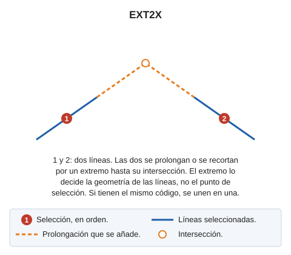

# EXT2X

Prolonga dos entidades hasta su intersección.

## Parámetros

No admite parámetros.

## Observaciones

La orden pide que selecciones dos líneas. La segunda línea tiene que pertenecer al modelo actual.

El punto de selección no decide qué extremo se prolonga. La orden calcula, para cada extremo de una línea, la intersección de la recta de su primer o último segmento con la otra línea, y solo acepta la intersección si cae en el primer o en el último segmento de la otra línea o en su prolongación. Si los dos extremos dan una intersección válida, la orden usa el extremo más cercano a su punto de intersección. Si la primera línea no da ninguna intersección válida, la orden prueba con la segunda.

La orden lleva un extremo de cada línea al punto de intersección:

* Si el punto de intersección está más allá del extremo, la línea se estira.
* Si el punto de intersección está sobre el primer o el último segmento, la línea se recorta.

Si no hay ninguna intersección válida, la orden emite el sonido de error y no modifica las líneas.

Si las dos líneas tienen el mismo código y los mismos atributos de base de datos, la orden las une en una sola línea con [UNIR](/digi3d-ai/referencia/ventana-de-dibujo/ordenes/u/unir.md).

## Características de la orden

| Tipo de orden | [Orden interactiva](ext2x.md) |
| :--- | :--- |
| Repite automáticamente | Si |
| Opción del menú donde aparece la orden | Editar/Polilíneas/Extender dos líneas existentes hasta su intersección |
| Barra de herramientas en la que aparece la orden | Extender/Recortar |
| Extensión | DigiNG.OrdenesStandard.dll |
| Variables relacionadas | [REPITE](/digi3d-ai/referencia/ventana-de-dibujo/variables/r/repite.md) — repite la última orden ejecutada |
| Nombre interno | {CA81C8F1-AAC5-49fb-9E9D-45F68C7CFC7A} |

