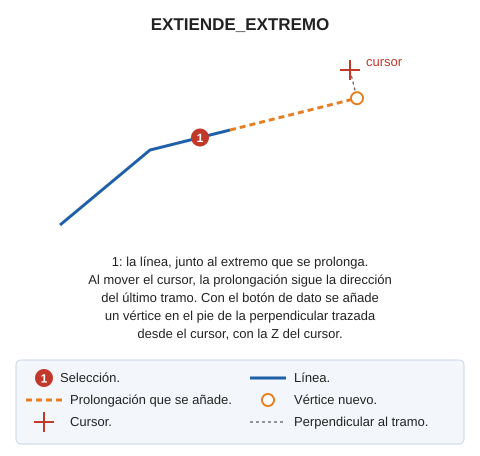

# EXTIENDE\_EXTREMO
<!-- id: extiende-extremo -->

Prolonga el extremo de una polilínea dinámicamente.

## Parámetros

No admite parámetros.

## Observaciones

Esta orden solicita que se seleccione una polilínea. Una vez seleccionada se prolongará el extremo más cercano a la selección hasta interseccionar con las coordenadas del cursor.

## Características de la orden

| Tipo de orden                                    | [Orden interactiva](ext.md)                                                                                                                                     |
| ------------------------------------------------ | --------------------------------------------------------------------------------------------------------------------------------------------------------------- |
| Repite automáticamente                           | Si                                                                                                                                                              |
| Opción del menú donde aparece la orden           | Editar/Polilíneas/Extiende extremo de polilínea dinámicamente                                                                                                   |
| Barra de herramientas en la que aparece la orden | Extender/Recortar                                                                                                                                               |
| Extensión                                        | DigiNG.OrdenesStandard.dll                                                                                                                                      |
| Variables relacionadas                           | [REPITE](/digi3d-ai/referencia/ventana-de-dibujo/variables/r/repite.md) — repite la última orden ejecutada |
| Órdenes relacionadas                             | [EXT](/digi3d-ai/referencia/ventana-de-dibujo/ordenes/e/ext.md) [EXT\_M](/digi3d-ai/referencia/ventana-de-dibujo/ordenes/e/ext-m.md) [EXT\_P](/digi3d-ai/referencia/ventana-de-dibujo/ordenes/e/ext-p.md) [EXT\_PLANO](/digi3d-ai/referencia/ventana-de-dibujo/ordenes/e/ext-plano.md) [EXT\_XYZ](/digi3d-ai/referencia/ventana-de-dibujo/ordenes/e/ext-xyz.md) [EXT2X](/digi3d-ai/referencia/ventana-de-dibujo/ordenes/e/ext2x.md) |
| Nombre interno | {2E2CEEA9-9946-4B2B-87FE-BC1D6175471F} |
