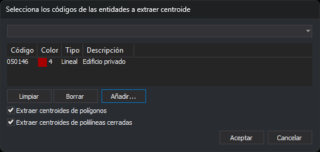

# EXTRAER\_CENTROIDES\_COD
<!-- id: extraer-centroides-cod -->

Crea un centroide, un texto situado en un punto interior, en cada polígono y en cada línea cerrada del archivo de dibujo activo que tenga alguno de los códigos seleccionados.

## Parámetros

No admite parámetros.

## Observaciones

### Cuadro de diálogo

Al ejecutar la orden se muestra el cuadro _Extraer centroides por código_:

| Control | Descripción |
| :--- | :--- |
| Desplegable superior | Lista las etiquetas de la tabla de códigos con el prefijo `#`. Al elegir una, la lista de códigos pasa a contener los códigos con esa etiqueta y el desplegable vuelve a quedar vacío |
| Lista de códigos | Códigos de las entidades en las que se crea el centroide, con su color, tipo y descripción |
| Limpiar | Vacía la lista de códigos |
| Borrar | Quita de la lista el código seleccionado |
| Añadir... | Abre el cuadro de selección de códigos y añade a la lista los códigos elegidos |
| Extraer centroides de polígonos | Si está marcada, la orden crea centroides en los polígonos |
| Extraer centroides de polilíneas cerradas | Si está marcada, la orden crea centroides en las líneas cerradas |

Si pulsas _Aceptar_ con la lista vacía, el cuadro muestra _Error: No se ha especificado ningún código para trabajar_ y sigue abierto. Si las dos casillas están desmarcadas, muestra _Marca al menos una de las dos casillas: polígonos o polilíneas cerradas_ y sigue abierto.

El cuadro no guarda la lista ni las casillas: cada vez que ejecutas la orden, la lista empieza vacía y las dos casillas están marcadas. Solo recuerda su posición y su tamaño.

Si pulsas _Cancelar_, la orden termina sin crear nada.

### Entidades que se procesan

La orden recorre las entidades del archivo de dibujo activo y crea un centroide en cada una que cumpla todas estas condiciones:

* es un polígono, si está marcada la primera casilla, o una línea cerrada, si está marcada la segunda. Una línea está cerrada si su primer y su último vértice coinciden en X e Y, aunque tengan distinta Z;
* tiene alguno de los códigos de la lista. Basta con uno de sus códigos, y la comparación admite los comodines `*` y `?`;
* no está borrada ni oculta, y alguno de sus códigos está visible en la ventana de dibujo;
* está dentro de la zona de interés.

La orden no comprueba si la entidad ya tiene un centroide: si la ejecutas dos veces, crea dos centroides en cada entidad.

### Centroide

Cada centroide es un texto:

* con todos los códigos de la entidad;
* cuyo contenido es el nombre del primer código de la entidad, que puede no ser el código de la lista;
* con el ángulo, la altura y la justificación de las variables AA, AT y JT;
* con la coordenada Z igual a 0, sea cual sea la Z de la entidad.

El punto de inserción está siempre dentro de la entidad, también en las entidades cóncavas:

* En un polígono, el punto está en la horizontal que pasa por la mitad de la altura del rectángulo que lo envuelve, dentro del contorno exterior y fuera de los huecos.
* En una línea cerrada, el punto es el centro del rectángulo que la envuelve si ese centro está dentro de la línea. Si no lo está, es el centro del tramo interior más largo de una horizontal que no pasa por ningún vértice.

El centroide no es el centro de masas de la entidad.

[UNDO](/digi3d-ai/referencia/ventana-de-dibujo/ordenes/u/undo.md) elimina de una vez todos los centroides que ha creado la orden.

## Características de la orden

| Tipo de orden | Orden inmediata |
| :--- | :--- |
| Repite automáticamente | No |
| Opción del menú donde aparece la orden | Dibujar/Centroides/Por código... |
| Barra de herramientas en la que aparece la orden | _Esta orden no tiene asociado ningún botón en ninguna barra de herramientas_ |
| Extensión | DigiNG.OrdenesTopologia.dll |
| Variables relacionadas | [AA](/digi3d-ai/referencia/ventana-de-dibujo/variables/a/aa.md) — establece el valor del ángulo activo [AT](/digi3d-ai/referencia/ventana-de-dibujo/variables/a/at.md) — establece la altura de los textos [JT](/digi3d-ai/referencia/ventana-de-dibujo/variables/j/jt.md) — cambia la justificación del texto al insertarlo |
| Órdenes relacionadas | [EXTRAER\_CENTROIDE](/digi3d-ai/referencia/ventana-de-dibujo/ordenes/e/extraer-centroide.md) [UNDO](/digi3d-ai/referencia/ventana-de-dibujo/ordenes/u/undo.md) |
| Nombre interno | {356024A0-F29F-44DC-B9F4-82F46594836A} |
