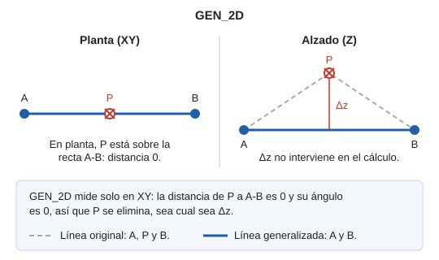

# GEN\_2D

Generaliza líneas y polígonos midiendo las distancias solo en el plano XY: la Z de los vértices no interviene. Conserva los vértices que la entidad comparte con otras entidades del archivo de dibujo.

## Parámetros

| Número de parámetro | Descripción | Opcional |
| :--- | :--- | :--- |
| 1 | Código. Si se indica, se generalizan todas las entidades del archivo de dibujo que tienen ese código, sin pedir selección. | Sí |

### Ejemplos

`GEN_2D`

Pide que selecciones la entidad que se va a generalizar.

`GEN_2D=010123`

Generaliza todas las entidades con el código `010123`.

## Cómo decide qué vértices elimina

Aplica el mismo algoritmo que [GEN](/digi3d-ai/referencia/ventana-de-dibujo/ordenes/g/gen.md), con las tolerancias [TOL](/digi3d-ai/referencia/ventana-de-dibujo/variables/t/tol.md) y [TOL\_ANG](/digi3d-ai/referencia/ventana-de-dibujo/variables/t/tol-ang.md), con dos diferencias:

1. **Mide las distancias y los ángulos en planta.** Un vértice alineado en planta con los extremos de su tramo se elimina aunque su Z sea distinta: la Z no entra en el cálculo.
2. **Conserva los vértices compartidos.** Un vértice cuyas coordenadas aparecen más de una vez en el archivo de dibujo se conserva aunque el algoritmo lo descarte. Así no se separan las entidades que se tocan en ese vértice. Las coordenadas tienen que coincidir exactamente.

El primer y el último vértice de la entidad se conservan siempre.

## Observaciones

- `GEN_2D` no generaliza los huecos de los polígonos ni las entidades complejas. Para ellos, usa [GEN](/digi3d-ai/referencia/ventana-de-dibujo/ordenes/g/gen.md).
- La entidad que seleccionas tiene que pertenecer al modelo actual. Con un código como parámetro, se generalizan las entidades con ese código de todo el archivo de dibujo.

## Características de la orden

| Tipo de orden | [Orden interactiva](gen-2d.md) |
| :--- | :--- |
| Repite automáticamente | Si |
| Opción del menú donde aparece la orden | _Esta orden no tiene asociada ninguna opción de menú_ |
| Barra de herramientas en la que aparece la orden | _Esta orden no tiene asociado ningún botón en ninguna barra de herramientas_ |
| Extensión | DigiNG.OrdenesStandard.dll |
| Variables relacionadas | [TOL](/digi3d-ai/referencia/ventana-de-dibujo/variables/t/tol.md) — factor de tolerancia en la generalización [TOL\_ANG](/digi3d-ai/referencia/ventana-de-dibujo/variables/t/tol-ang.md) — factor de tolerancia angular en la generalización [REPITE](/digi3d-ai/referencia/ventana-de-dibujo/variables/r/repite.md) — repite la última orden ejecutada |
| Órdenes relacionadas | [DENSIFICA](/digi3d-ai/referencia/ventana-de-dibujo/ordenes/d/densifica.md) [GEN](/digi3d-ai/referencia/ventana-de-dibujo/ordenes/g/gen.md) [TOL](/digi3d-ai/referencia/ventana-de-dibujo/ordenes/t/tol.md) [TOL\_ANG](/digi3d-ai/referencia/ventana-de-dibujo/ordenes/t/tol-ang.md) |
| Nombre interno | {5F383460-6116-4324-9BA8-38DC97E6E5B1} |
