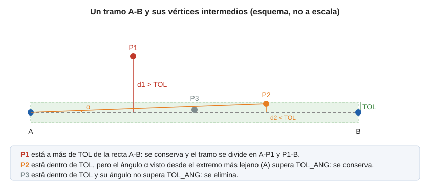
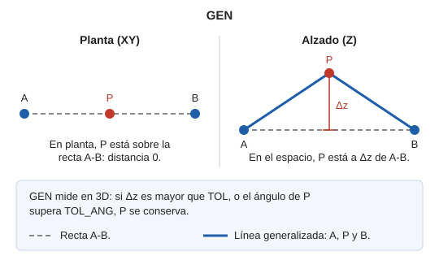

# GEN
<!-- id: gen -->

Generaliza líneas, polígonos y entidades complejas: elimina los vértices superfluos midiendo las distancias en el espacio (X, Y y Z).

## Parámetros

| Número de parámetro | Descripción | Opcional |
| :--- | :--- | :--- |
| 1 | Código. Si se indica, se generalizan todas las entidades del archivo de dibujo que tienen ese código, sin pedir selección. | Sí |

### Ejemplos

`GEN`

Pide que selecciones la entidad que se va a generalizar.

`GEN=010123`

Generaliza todas las entidades con el código `010123`.

## Cómo decide qué vértices elimina

La orden aplica el algoritmo de Douglas-Peucker con dos tolerancias:

- [TOL](/digi3d-ai/referencia/ventana-de-dibujo/variables/t/tol.md): distancia máxima, en metros.
- [TOL\_ANG](/digi3d-ai/referencia/ventana-de-dibujo/variables/t/tol-ang.md): ángulo máximo, en grados sexagesimales. Al iniciar Digi3D.AI vale 4,58.

El algoritmo empieza con un único tramo, del primer vértice al último, y para cada tramo hace lo siguiente:

1. Calcula la distancia de cada vértice intermedio a la recta que une los dos extremos del tramo.
2. Si algún vértice está a más de **TOL**, conserva el más alejado y repite el proceso en los dos tramos que resultan, a un lado y a otro de ese vértice.
3. Si ninguno supera **TOL**, conserva el vértice cuyo ángulo, visto desde el extremo más lejano del tramo, sea mayor, siempre que supere **TOL\_ANG**, y repite el proceso a cada lado.
4. Si ningún vértice supera ninguna de las dos tolerancias, elimina todos los vértices intermedios del tramo.

El primer y el último vértice de la entidad se conservan siempre. En los polígonos se generalizan también los huecos, y en las entidades complejas, cada una de las entidades que las forman.

## GEN o GEN\_2D

`GEN` mide las distancias en el espacio. Un vértice que en planta está alineado con sus vecinos **se conserva** si su Z se separa de la recta más de **TOL**, o si su ángulo supera **TOL\_ANG**. Para que la Z no cuente, usa [GEN\_2D](/digi3d-ai/referencia/ventana-de-dibujo/ordenes/g/gen-2d.md), que mide solo en el plano XY.

Por ejemplo, con tres vértices alineados en planta a 5 m unos de otros y el central desplazado en Z:

| Desplazamiento en Z del vértice central | TOL | TOL\_ANG | GEN | GEN\_2D |
| :--- | :--- | :--- | :--- | :--- |
| 0,5 m | 0,004 | 4,58 | Se conserva | Se elimina |
| 0,003 m | 0,004 | 4,58 | Se elimina | Se elimina |
| 0,5 m | 1 | 4,58 | Se conserva (el ángulo es de 5,7°, mayor que 4,58°) | Se elimina |
| 0,5 m | 1 | 6 | Se elimina | Se elimina |

## Observaciones

- Con **TOL\_ANG** igual a 0 no se elimina ningún vértice que no esté exactamente alineado con los extremos de su tramo: cualquier ángulo mayor que 0 lo conserva.
- La entidad que seleccionas tiene que pertenecer al modelo actual. Con un código como parámetro, se generalizan las entidades con ese código de todo el archivo de dibujo.

## Características de la orden

| Tipo de orden | [Orden interactiva](gen.md) |
| :--- | :--- |
| Repite automáticamente | Si |
| Opción del menú donde aparece la orden | Editar/Polilíneas/Generalizar |
| Barra de herramientas en la que aparece la orden | Editar polilínea |
| Extensión | DigiNG.OrdenesStandard.dll |
| Variables relacionadas | [TOL](/digi3d-ai/referencia/ventana-de-dibujo/variables/t/tol.md) — factor de tolerancia en la generalización [TOL\_ANG](/digi3d-ai/referencia/ventana-de-dibujo/variables/t/tol-ang.md) — factor de tolerancia angular en la generalización [REPITE](/digi3d-ai/referencia/ventana-de-dibujo/variables/r/repite.md) — repite la última orden ejecutada |
| Órdenes relacionadas | [DENSIFICA](/digi3d-ai/referencia/ventana-de-dibujo/ordenes/d/densifica.md) [GEN\_2D](/digi3d-ai/referencia/ventana-de-dibujo/ordenes/g/gen-2d.md) [TOL](/digi3d-ai/referencia/ventana-de-dibujo/ordenes/t/tol.md) [TOL\_ANG](/digi3d-ai/referencia/ventana-de-dibujo/ordenes/t/tol-ang.md) |
| Nombre interno | {F8D89367-AF3E-4436-BD02-35C3306D5DE7} |
