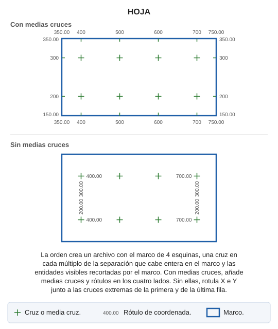

# HOJA

Crea un archivo de dibujo con un marco de hoja a una determinada escala, con marcas cada cierta distancia y rótulos de coordenadas.

## Parámetros

| Número de parámetro | Parámetro | Parámetros | Descripción |
| :--- | :--- | :--- | :--- |
| 1 | Coordenadas de las esquinas de la hoja | Mediante un gráfico, los campos correspondientes a las coordenadas X e Y se pueden rellenar. |  |
| 2 | Propiedades generales |Escala Código del marco|Escala a la que se va a crear la hoja Código con el que se generará la línea de marco de hoja|
| 3 | Propiedades de las cruces |Código cruces Altura de cruces Separación cruces Medias cruces|Código con el que se generarán las cruces de la hoja Tamaño, en mm de impresión, de las cruces que se generarán en el interior de la hoja Separación, en mm de impresión, entre cruces Indica si insertar medias cruces en el límite de la hoja|
| 4 | Propiedades de las coordenadas |Código coordenadas Altura de coordenadas Nº decimales|Código con el que se generarán las coordenadas de la hoja Altura, en mm de impresión, de los textos de coordenadas Número de decimales de los textos de las coordenadas|

## Observaciones

La orden pide primero el archivo de dibujo que se va a crear y después muestra el cuadro de diálogo con los campos de la tabla. El archivo nuevo contiene:

* El marco, con las cuatro esquinas indicadas.
* Una cruz en cada punto cuyas coordenadas X e Y son múltiplos de la separación en el terreno (separación en mm × escala ÷ 1000). Solo se añaden las cruces que caben enteras dentro del marco.
* Si está activada la opción de medias cruces, una media cruz donde esas coordenadas cortan el borde del marco y un rótulo con la coordenada junto a cada una, más los rótulos de las esquinas con el número de decimales indicado.
* Si la opción de medias cruces está desactivada, rótulos de X e Y, con el número de decimales indicado, junto a la primera y la última cruz de la primera fila y de la última fila. El rótulo de Y va girado 90°.
* Las entidades visibles del archivo de dibujo actual, recortadas por el marco.

Además, la orden escribe junto al archivo nuevo un archivo con extensión `.utm` con las coordenadas de las cuatro esquinas.

## Características de la orden

| Tipo de orden | [Orden interactiva](hoja.md) |
| :--- | :--- |
| Repite automáticamente | No |
| Opción del menú donde aparece la orden | Dibujar/Gráfico de hojas/Crear una hoja por coordenadas conocidas |
| Barra de herramientas en la que aparece la orden | _Esta orden no tiene asociado ningún botón en ninguna barra de herramientas_ |
| Extensión | DigiNG.OrdenesStandard.dll |
| Variables relacionadas | No tiene variables relacionadas |
| Nombre interno | {CF3F30DF-C61A-4424-AF32-AE28716A0EEC} |

