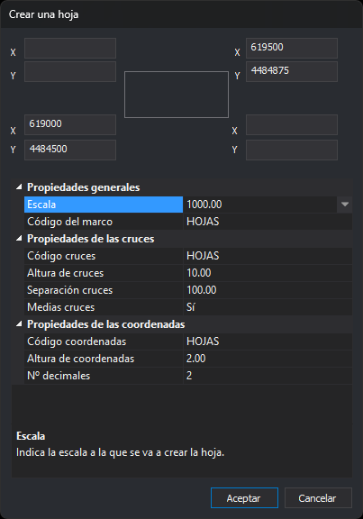

# HOJA
<!-- id: hoja -->

Crea un archivo de dibujo con un marco de hoja a una determinada escala, con marcas cada cierta distancia y rótulos de coordenadas.

La orden no tiene parámetros.

## Observaciones

La orden pide primero el archivo de dibujo que se va a crear. El formato depende de la extensión; si el formato tiene parámetros, la orden los pide a continuación. Si el archivo ya existe, se pide confirmación para sobrescribirlo. Después la orden muestra el cuadro de diálogo **Crear una hoja**.

Al pulsar **Aceptar**, la orden crea el archivo con estas entidades:

* El marco: una línea cerrada con el código del marco que une las cuatro esquinas.
* Una cruz, formada por un trazo horizontal y uno vertical con el código de las cruces, en cada punto cuyas coordenadas X e Y son múltiplos de la separación en el terreno. Solo se añaden las cruces cuyos cuatro extremos quedan dentro del marco o sobre él.
* Con **Medias cruces** activado:
  * Una media cruz en cada punto del borde del marco cuya X (lados inferior y superior) o cuya Y (lados izquierdo y derecho) es múltiplo de la separación, sin contar las esquinas. La media cruz mide la mitad de la altura de las cruces y apunta hacia el interior del marco.
  * Junto a cada media cruz, un rótulo con esa coordenada sin decimales, fuera del marco: debajo del lado inferior, encima del superior, a la izquierda del lado izquierdo y a la derecha del derecho.
  * En cada esquina, un rótulo con su X y otro con su Y, con el número de decimales indicado.
* Con **Medias cruces** desactivado, rótulos de coordenadas con el número de decimales indicado junto a la cruz de la izquierda y la de la derecha de la fila inferior de cruces y de la fila superior: el rótulo de X al lado de la cruz, hacia el interior, y el de Y girado 90°, encima de las cruces de la fila inferior y debajo de las de la fila superior.
* Las entidades del archivo de dibujo actual que son visibles y están en la zona de interés, sin los códigos apagados:
  * Las líneas, recortadas por el marco: se copian los trozos interiores.
  * Los puntos y los textos cuyo punto de inserción está dentro del marco.
  * Los polígonos, los elementos complejos, los multipuntos y las imágenes que quedan enteros dentro del marco. Los que cruzan el marco no se copian.

Los valores de las propiedades se miden en milímetros de papel. En el terreno equivalen a valor × escala ÷ 1000: con escala 1000 y separación 100, las cruces se colocan cada 100 m.

Cruces, medias cruces y rótulos siguen siempre los ejes X e Y. Si escribes las cuatro esquinas de una hoja girada, el marco sigue esas esquinas, pero las marcas no se giran.

Además, la orden crea junto al archivo nuevo un archivo con extensión `.utm` que contiene las coordenadas de las esquinas, una por línea, en este orden: inferior izquierda, inferior derecha, superior derecha y superior izquierda. Si no se puede crear el archivo `.utm`, el panel de tareas muestra el error y la hoja se crea igualmente.

La orden no modifica el archivo de dibujo abierto, así que no hay nada que deshacer. El archivo nuevo no se abre.

Si cancelas el cuadro de selección de archivo, suena el aviso de error y la orden termina. Si no se puede crear el archivo, la orden muestra un mensaje de error.

## Cuadro de diálogo Crear una hoja

* **Esquinas**: cada esquina tiene su X y su Y, en la posición que ocupa en el cuadro de diálogo.
  * Escribe la esquina inferior izquierda y la superior derecha. Las dos empiezan en `0.0`.
  * Las esquinas superior izquierda e inferior derecha empiezan vacías y muestran en gris el valor que tomarán. Al pulsar **Aceptar**, cada campo vacío se completa a partir de las otras dos esquinas, de modo que el marco es un rectángulo con los lados paralelos a los ejes: la superior izquierda toma la X de la inferior izquierda y la Y de la superior derecha, y la inferior derecha toma la X de la superior derecha y la Y de la inferior izquierda.
  * Para una hoja girada, escribe las cuatro esquinas.
* **Propiedades generales**
  * **Escala**: escala de la hoja. Se puede escribir o elegir de la lista. Tiene que ser mayor que 0.
  * **Código del marco**: código de la línea del marco.
* **Propiedades de las cruces**
  * **Código cruces**: código de las cruces y de las medias cruces.
  * **Altura de cruces**: longitud de cada trazo de la cruz, en mm de papel.
  * **Separación cruces**: distancia entre cruces, en mm de papel. Tiene que ser mayor que 0.
  * **Medias cruces**: añade medias cruces y rótulos en el borde del marco.
* **Propiedades de las coordenadas**
  * **Código coordenadas**: código de los rótulos de coordenadas.
  * **Altura de coordenadas**: altura de los rótulos, en mm de papel.
  * **Nº decimales**: decimales de los rótulos de las esquinas y, sin medias cruces, de todos los rótulos.

Si la escala o la separación no son mayores que 0, la orden muestra un mensaje y el cuadro de diálogo sigue abierto.

Digi3D.AI recuerda las propiedades entre ejecuciones; las coordenadas de las esquinas no se recuerdan. La primera vez, la escala es la configurada en Digi3D.AI o 1000; la altura de cruces 10; la separación 100; la altura de coordenadas 2; los códigos `HOJAS`; las medias cruces activadas y 2 decimales.

## Características de la orden

| Tipo de orden | [Orden interactiva](/digi3d-ai/referencia/ventana-de-dibujo/ordenes-interactivas.md) |
| :--- | :--- |
| Repite automáticamente | No |
| Opción del menú donde aparece la orden | Dibujar/Gráfico de hojas/Crear una hoja por coordenadas conocidas |
| Barra de herramientas en la que aparece la orden | _Esta orden no tiene asociado ningún botón en ninguna barra de herramientas_ |
| Extensión | DigiNG.OrdenesStandard.dll |
| Variables relacionadas | No tiene variables relacionadas |
| Órdenes relacionadas | [RECORTA\_TRAZA](/digi3d-ai/referencia/ventana-de-dibujo/ordenes/r/recorta-traza.md) [TRAZA](/digi3d-ai/referencia/ventana-de-dibujo/ordenes/t/traza.md) |
| Nombre interno | {CF3F30DF-C61A-4424-AF32-AE28716A0EEC} |
