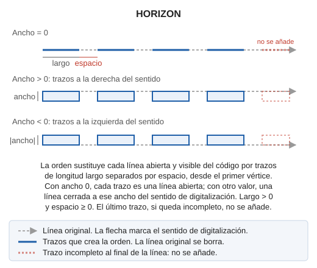
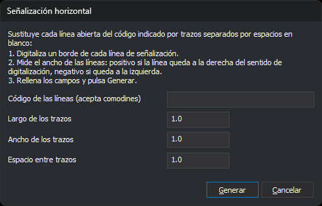

# HORIZON
<!-- id: horizon -->

Sustituye cada línea abierta de un código por trazos de un largo fijo separados por espacios en blanco, para dibujar líneas discontinuas de señalización horizontal. Cada trazo puede ser una línea abierta o un polígono cerrado con un ancho.

## Parámetros

No admite parámetros.

## Observaciones

### Cuadro de diálogo

Al ejecutar la orden se muestra el cuadro _Señalización horizontal_. El procedimiento es:

1. Digitaliza un borde de cada línea de señalización como una línea abierta con un mismo código.
2. Mide el ancho de las líneas de señalización.
3. Ejecuta HORIZON, rellena los campos y pulsa _Generar_.

| Campo | Descripción | Valor por defecto |
| :--- | :--- | :--- |
| Código de las líneas (acepta comodines) | Código de las líneas que se van a sustituir. Admite los comodines `*` (cualquier secuencia de caracteres hasta el final del código) y `?` (un carácter cualquiera). Distingue mayúsculas de minúsculas | _Vacío_ |
| Largo de los trazos | Longitud de cada trazo, medida en planta a lo largo de la línea. Tiene que ser un número mayor que 0 | 1.0 |
| Ancho de los trazos | Con 0, cada trazo es una línea abierta. Con un valor positivo, cada trazo es un polígono cerrado que se extiende ese ancho a la derecha del sentido de digitalización; con un valor negativo, a la izquierda | 1.0 |
| Espacio entre trazos | Longitud del espacio en blanco entre dos trazos, medida en planta a lo largo de la línea. Tiene que ser un número mayor o igual que 0 | 1.0 |

Las tres medidas están en las unidades de las coordenadas del archivo de dibujo.

Si pulsas _Generar_, el cuadro comprueba los tres valores numéricos. Si alguno no es un número, o no cumple su condición, el cuadro muestra un mensaje, sitúa el cursor en ese campo y sigue abierto sin guardar nada. Si los valores son válidos, la orden los guarda en los valores `Codigo`, `Largo`, `Ancho` y `Espacio` de la clave del registro `HKEY_CURRENT_USER\Software\Digi21\Digi3D.NET\DigiNG\Extensiones\DigiNG.OrdenesStandard\Horizon`. La siguiente vez que ejecutes la orden, el cuadro muestra esos valores.

Si pulsas _Cancelar_, la orden termina sin guardar los valores y sin modificar el archivo.

### Líneas que se procesan

La orden procesa las líneas del archivo de dibujo activo que cumplen todas estas condiciones:

* tienen el código indicado, como código principal o como código secundario;
* son abiertas;
* son visibles y están dentro de la zona de interés.

Las líneas cerradas, las de los archivos de referencia y el resto de entidades no cambian. Si el campo del código está vacío, la orden no procesa ninguna línea.

### Trazos

Para cada línea, la orden empieza en el primer vértice y avanza en el sentido de digitalización: un trazo de _Largo_, un espacio de _Espacio_, otro trazo, y así hasta el último vértice. Un trazo que cruza un vértice de la línea incluye ese vértice. La coordenada Z de cada extremo de un trazo se interpola entre los dos vértices del tramo en el que está.

* Con _Ancho_ igual a 0, cada trazo es una línea abierta sobre la línea original.
* Con _Ancho_ distinto de 0, cada trazo es una línea cerrada: recorre el tramo de la línea original y vuelve por una paralela situada a la distancia _Ancho_. En un trazo recto, el resultado es un rectángulo.

Si la línea termina a mitad de un trazo, ese último trazo no se crea. Una línea más corta que _Largo_ desaparece sin dejar ningún trazo.

La orden borra cada línea original y añade sus trazos al archivo de dibujo activo. Los trazos **no** conservan el código de la línea original: se crean con el código activo y los atributos activos.

Mientras genera los trazos, la orden no inserta vértices en las intersecciones aunque esté activada la inserción automática. Al terminar, restaura el valor anterior de la inserción automática.

Antes de modificar el archivo, la orden estima cuántos trazos va a crear. Si son más de 1.000.000, muestra un mensaje y termina sin modificar nada. Aumenta el largo o el espacio.

Si una extensión o el formato del archivo impiden borrar una línea, esa línea se conserva sin trazos y la orden emite el sonido de error.

[UNDO](/digi3d-ai/referencia/ventana-de-dibujo/ordenes/u/undo.md) restaura de una vez todas las líneas originales y elimina todos los trazos.

## Características de la orden

| Tipo de orden | [Orden interactiva](/digi3d-ai/referencia/ventana-de-dibujo/ordenes-interactivas.md) |
| :--- | :--- |
| Repite automáticamente | No |
| Opción del menú donde aparece la orden | Dibujar/Más/Líneas de señalización horizontal |
| Barra de herramientas en la que aparece la orden | Señalización horizontal |
| Extensión | DigiNG.OrdenesStandard.dll |
| Variables relacionadas | No tiene variables relacionadas |
| Órdenes relacionadas | [CEBRA](/digi3d-ai/referencia/ventana-de-dibujo/ordenes/c/cebra.md) [CEBRA\_4P](/digi3d-ai/referencia/ventana-de-dibujo/ordenes/c/cebra-4p.md) [UNDO](/digi3d-ai/referencia/ventana-de-dibujo/ordenes/u/undo.md) |
| Nombre interno | {340C33D2-7D89-4772-AFF1-D274F8735395} |
