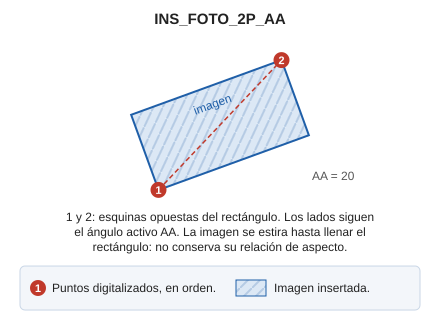

# INS\_FOTO\_2P\_AA

Inserta una imagen en el archivo de dibujo mediante dos puntos y ángulo activo.

## Parámetros

No admite parámetros.

## Observaciones

Para ejecutar esta orden hace falta establecer el valor del ángulo activo ([AA](/digi3d-ai/referencia/ventana-de-dibujo/variables/a/aa.md)). Los lados de la imagen siguen ese ángulo.

La orden pide primero el archivo de imagen. Después requiere la entrada de las dos esquinas opuestas del rectángulo que ocupará la imagen. La imagen se estira hasta llenar el rectángulo, así que no conserva su relación de aspecto. Los puntos podrán introducirse:

* De forma gráfica, señalándolos con el cursor/ratón.
* Por entrada de sus coordenadas desde teclado \([XY](/digi3d-ai/referencia/ventana-de-dibujo/ordenes/x/xy.md).
* Desde archivo \([N](/digi3d-ai/referencia/ventana-de-dibujo/ordenes/n/n.md).

## Características de la orden

| Tipo de orden | [Orden interactiva](ins-foto-2p-aa.md) |
| :--- | :--- |
| Repite automáticamente | No |
| Opción del menú donde aparece la orden | _Dibujar/Imagen/Mediante dos puntos y ángulo activo_ |
| Barra de herramientas en la que aparece la orden | _Esta orden no tiene asociado ningún botón en ninguna barra de herramientas_ |
| Extensión | DigiNG.OrdenesRaster.dll |
| Variables relacionadas | [AA](/digi3d-ai/referencia/ventana-de-dibujo/variables/a/aa.md) — ángulo activo |
| Nombre interno | {3402C7CF-6346-4C66-A043-EE0869AF6F4C} |

