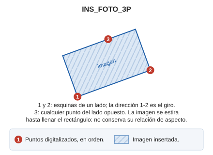

# INS\_FOTO\_3P

Inserta una imagen en el archivo de dibujo mediante tres puntos.

## Parámetros

No admite parámetros.

## Observaciones

La orden pide primero el archivo de imagen. Después requiere la entrada de 3 puntos, de forma que los dos primeros se corresponden con las esquinas de un lado, y el tercero con cualquier punto perteneciente al lado opuesto \(no es necesario que se corresponda con una esquina\).

Los puntos pueden definirse de forma gráfica o mediante la orden [XY](/digi3d-ai/referencia/ventana-de-dibujo/ordenes/x/xy.md).

El resultado final es que la imagen se orienta formando el rectángulo que solapa con los tres puntos digitalizados. La dirección del primer punto al segundo es el giro de la imagen. La imagen se estira hasta llenar el rectángulo, así que no conserva su relación de aspecto.

## Características de la orden

| Tipo de orden | [Orden interactiva](ins-foto-3p.md) |
| :--- | :--- |
| Repite automáticamente | No |
| Opción del menú donde aparece la orden | _Dibujar/Imagen/Mediante tres puntos_ |
| Barra de herramientas en la que aparece la orden | _Esta orden no tiene asociado ningún botón en ninguna barra de herramientas_ |
| Extensión | DigiNG.OrdenesRaster.dll |
| Variables relacionadas | No tiene variables relacionadas |
| Órdenes relacionadas | [INS\_FOTO](/digi3d-ai/referencia/ventana-de-dibujo/ordenes/i/ins-foto.md) [INS\_FOTO\_2P\_AA](/digi3d-ai/referencia/ventana-de-dibujo/ordenes/i/ins-foto-2p-aa.md) |
| Nombre interno | {0339F78C-FCBF-46E3-8FCA-7F0B19B4D956} |

