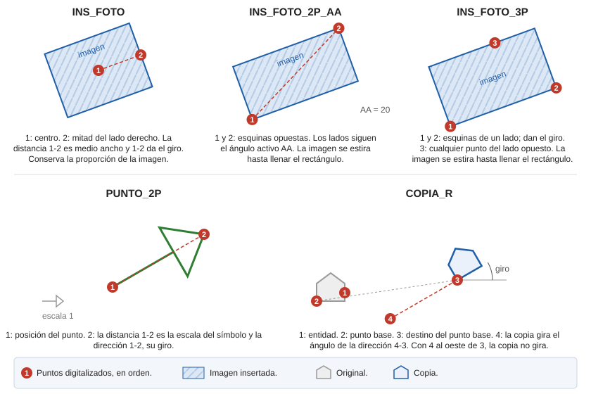

# INS\_FOTO

Inserta una imagen en el archivo de dibujo mediante dos puntos: el primero para el centro y el segundo para indicar la rotación y escala.

## Parámetros

No admite parámetros.

## Observaciones

La orden pide primero el archivo de imagen. Después:

1. Digitaliza el centro de la imagen.
2. Digitaliza el punto medio del lado derecho de la imagen. La distancia entre los dos puntos es la mitad del ancho de la imagen, y la dirección del primero al segundo es su giro.

Esta orden respeta la relación de aspecto de la imagen.

## Características de la orden

| Tipo de orden | [Orden interactiva](ins-foto.md) |
| :--- | :--- |
| Repite automáticamente | No |
| Opción del menú donde aparece la orden | _Dibujar/Imagen/Mediante dos puntos: Centro y radio_ |
| Barra de herramientas en la que aparece la orden | _Esta orden no tiene asociado ningún botón en ninguna barra de herramientas_ |
| Extensión | DigiNG.OrdenesRaster.dll |
| Variables relacionadas | No tiene variables relacionadas |
| Nombre interno | {F0CE7FBF-190A-4007-BBD6-6737934D86CE} |

