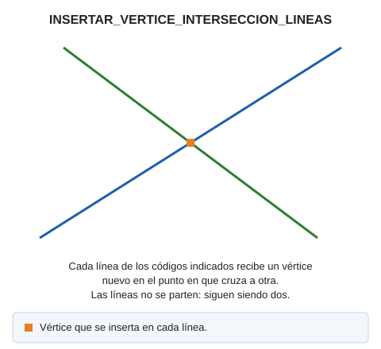

# INSERTAR\_VERTICE\_INTERSECCION\_LINEAS
<!-- id: insertar-vertice-interseccion-lineas -->

Inserta un vértice en la intersección de las líneas de los códigos pasados por parámetro.

## Parámetros

| Número de parámetro | Descripción | Opcional |
| :--- | :--- | :--- |
| 1 | Código o códigos (uno o más, separados por espacios) | Si |

Si Digi3D.AI descarta alguna de las líneas nuevas, la orden no aplica el cambio y se conservan todas las líneas originales.

## Características de la orden

| Tipo de orden | [Orden inmediata](insertar-vertice-interseccion-lineas.md) |
| :--- | :--- |
| Repite automáticamente | No |
| Opción del menú donde aparece la orden | _Esta orden no tiene asociada ninguna opción de menú_ |
| Barra de herramientas en la que aparece la orden | _Esta orden no tiene asociado ningún botón en ninguna barra de herramientas_ |
| Extensión | DigiNG.OrdenesTopologia.dll |
| Variables relacionadas | No tiene variables relacionadas |
| Órdenes relacionadas | [INSERTAR\_VERTICE\_INTERSECCION\_LINEA\_PUNTO](/digi3d-ai/referencia/ventana-de-dibujo/ordenes/i/insertar-vertice-interseccion-linea-punto.md) [INSERTAR\_VERTICE\_INTERSECCION\_LINEAS\_VISIBLES](/digi3d-ai/referencia/ventana-de-dibujo/ordenes/i/insertar-vertice-interseccion-lineas-visibles.md) [PARTIR\_LINEAS](/digi3d-ai/referencia/ventana-de-dibujo/ordenes/p/partir-lineas.md) |
| Nombre interno | {59BA7DE5-4A58-45FB-9B17-41D40612F28C} |
