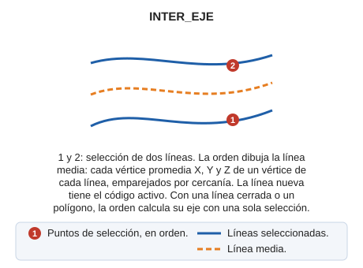

# INTER\_EJE

Interpola una entidad entre otras dos seleccionadas por el usuario.

## Parámetros

No admite parámetros.

## Observaciones

La interpolación se hará en coordenadas \(X Y Z\). La nueva entidad se registrará con el código activo en el momento de ejecutar la orden.

Si la primera entidad seleccionada es un polígono o una línea cerrada en planta, la orden no pide una segunda línea: calcula el eje de esa entidad con una sola selección. Para ello triangula su contorno y une los puntos medios de los lados interiores de los triángulos. De un polígono, la orden usa solo el contorno exterior.

La orden rechaza las líneas en zigzag, es decir, las que tienen un vértice cuyo vértice anterior y vértice siguiente coinciden. Con una de esas líneas, la orden emite el sonido de error y muestra el mensaje «La línea seleccionada tiene un ZigZag».

## Características de la orden

| Tipo de orden | [Orden interactiva](inter-eje.md) |
| :--- | :--- |
| Repite automáticamente | No |
| Opción del menú donde aparece la orden | Dibujar/Interpolar eje de dos líneas existentes |
| Barra de herramientas en la que aparece la orden | Interpolación |
| Extensión | DigiNG.OrdenesStandard.dll |
| Variables relacionadas | No tiene variables relacionadas |
| Órdenes relacionadas | [INTER](/digi3d-ai/referencia/ventana-de-dibujo/ordenes/i/inter.md) |
| Nombre interno | {4B787BBC-9658-4f8c-B83E-C83D3005FC91} |

