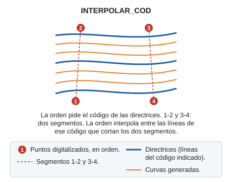

# INTERPOLAR\_COD
<!-- id: interpolar-cod -->

Interpola curvas de nivel con cuatro puntos tomando como directrices las entidades de un código.

## Parámetros

No admite parámetros.

## Características de la orden

| Tipo de orden | [Orden interactiva](interpolar-cod.md) |
| :--- | :--- |
| Repite automáticamente | No |
| Opción del menú donde aparece la orden | Dibujar/Interpolar curvas con 4 puntos... |
| Barra de herramientas en la que aparece la orden | Interpolación |
| Extensión | DigiNG.OrdenesStandard.dll |
| Variables relacionadas | No tiene variables relacionadas |
| Órdenes relacionadas | [INTER](/digi3d-ai/referencia/ventana-de-dibujo/ordenes/i/inter.md) |
| Nombre interno | {949F298F-5D9A-4762-88C8-B8514EEFA9AE} |
