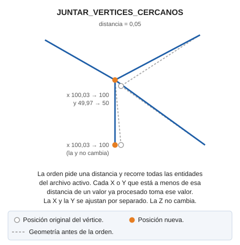

# JUNTAR\_VERTICES\_CERCANOS

Junta vértices cercanos por tolerancia.

La orden muestra un cuadro de diálogo que pide una distancia y procesa todas las entidades del archivo de dibujo activo, incluidos los huecos de los polígonos y las entidades de los complejos. Las coordenadas X y las Y se ajustan por separado: cada X que está a menos de la distancia de una X ya procesada toma ese valor, y lo mismo con la Y. Por eso dos vértices lejanos con X casi iguales también reciben la misma X. La Z no cambia.

## Parámetros

No admite parámetros.

## Características de la orden

| Tipo de orden | [Orden inmediata](juntar-vertices-cercanos.md) |
| :--- | :--- |
| Repite automáticamente | No |
| Opción del menú donde aparece la orden | Análisis geométricos/Juntar vértices cercanos... |
| Barra de herramientas en la que aparece la orden | _Esta orden no tiene asociado ningún botón en ninguna barra de herramientas_ |
| Extensión | DigiNG.OrdenesTopologia.dll |
| Variables relacionadas | No tiene variables relacionadas |
| Nombre interno | {8312B2CC-7C50-456A-81A0-36737CE1B41C} |
