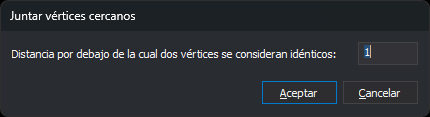

# JUNTAR\_VERTICES\_CERCANOS
<!-- id: juntar-vertices-cercanos -->

Iguala las coordenadas X y las coordenadas Y de los vértices del archivo de dibujo activo que difieren en una distancia indicada o menos.

## Parámetros

No admite parámetros.

## Observaciones

### Cuadro de diálogo

Esta orden solicita la distancia en el cuadro _Juntar vértices cercanos_:

| Campo | Descripción | Valor por defecto |
| :--- | :--- | :--- |
| Distancia por debajo de la cual dos vértices se consideran idénticos | Diferencia máxima, en unidades del archivo de dibujo, entre dos coordenadas X o entre dos coordenadas Y para que tomen el mismo valor | 1 |

El cuadro muestra siempre el valor 1: la orden no guarda la distancia de una ejecución a otra. Si el texto no es un número, el cuadro muestra un aviso y no se cierra. Si pulsas _Cancelar_, la orden termina sin modificar nada.

### Cómo se juntan las coordenadas

La orden recorre las entidades del archivo de dibujo activo en el orden en que están en el archivo. Las entidades borradas no se tratan. En cada entidad procesa:

* sus vértices (en un punto o un texto, el punto de inserción; en un complejo, su punto de inserción);
* los vértices de los huecos, si es un polígono;
* los vértices de las entidades que lo forman, si es un complejo. No se procesan los huecos de un polígono que forma parte de un complejo ni las entidades de un complejo que está dentro de otro.

Las coordenadas X y las coordenadas Y se tratan por separado. Cada X se compara con las X ya procesadas: si encuentra una que difiere en la distancia indicada o menos, la X toma ese valor; si no, se conserva y pasa a ser una X procesada. Lo mismo se hace con las Y. Por eso:

* dos vértices alejados entre sí cuyas X difieren en la distancia o menos reciben la misma X, aunque sus Y sean muy distintas;
* el valor que se conserva es el del vértice que se procesó antes, y el resultado depende del orden de las entidades en el archivo.

La Z no cambia. Con una distancia negativa ninguna coordenada cambia.

### Resultado

La orden sustituye por una copia corregida cada entidad que tiene alguna X o alguna Y distinta. Las entidades sin cambios no se tocan. Si ninguna cambia, el archivo no se modifica. La orden no muestra ningún mensaje al terminar.

## Características de la orden

| Tipo de orden | Orden inmediata |
| :--- | :--- |
| Repite automáticamente | No |
| Opción del menú donde aparece la orden | Análisis geométricos/Juntar vértices cercanos... |
| Barra de herramientas en la que aparece la orden | _Esta orden no tiene asociado ningún botón en ninguna barra de herramientas_ |
| Extensión | DigiNG.OrdenesTopologia.dll |
| Variables relacionadas | No tiene variables relacionadas |
| Órdenes relacionadas | [JUNTAR](/digi3d-ai/referencia/ventana-de-dibujo/ordenes/j/juntar.md) |
| Nombre interno | {8312B2CC-7C50-456A-81A0-36737CE1B41C} |
