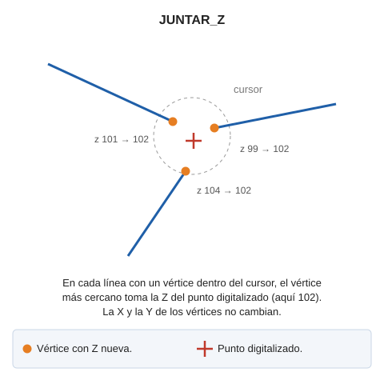

# JUNTAR\_Z

Asigna la Z de un punto digitalizado al vértice más cercano de cada línea próxima a ese punto.

## Parámetros

| Número de parámetro | Descripción | Valores | Opcional |
| :--- | :--- | :--- | :--- |
| 1 | Tamaño del cursor | Número real | Si |

## Observaciones

Al digitalizar un punto, la orden busca las líneas visibles que tienen un vértice dentro del tamaño del cursor de la ventana de dibujo. En cada una de esas líneas, la orden cambia solo el vértice más cercano al punto digitalizado: ese vértice toma la Z del punto. El resto de vértices no cambia. La orden no modifica las coordenadas X e Y.

La orden termina después de procesar un punto.

## Características de la orden

| Tipo de orden | [Orden interactiva](juntar-z.md) |
| :--- | :--- |
| Repite automáticamente | Si |
| Opción del menú donde aparece la orden | _Esta orden no tiene asociada ninguna opción de menú_ |
| Barra de herramientas en la que aparece la orden | _Esta orden no tiene asociado ningún botón en ninguna barra de herramientas_ |
| Extensión | DigiNG.OrdenesStandard.dll |
| Variables relacionadas | [REPITE](/digi3d-ai/referencia/ventana-de-dibujo/variables/r/repite.md) — repite la última orden ejecutada |
| Nombre interno | {A8120372-9CF4-4ff9-A6DE-035E717C746A} |

