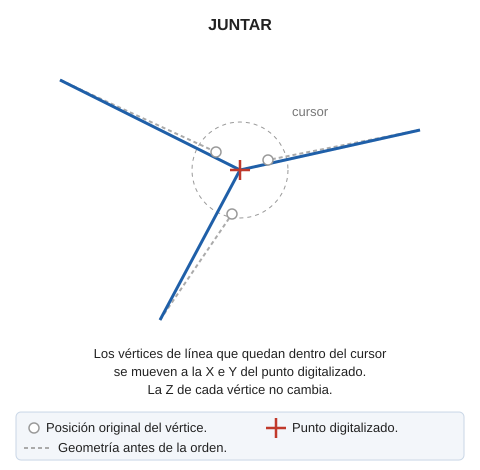

# JUNTAR

Traslada todos los puntos en un entorno, que será determinado por el tamaño del cursor, a un mismo punto. Solo cambian las coordenadas X e Y de los vértices; la Z no cambia.

## Parámetros

| Número de parámetro | Descripción | Valores | Opcional |
| :--- | :--- | :--- | :--- |
| 1 | Tamaño del cursor, en píxeles | Número entero | Si |

Sin parámetro, la orden usa el tamaño del cursor de la ventana de dibujo.

## Características de la orden

| Tipo de orden | [Orden interactiva](juntar.md) |
| :--- | :--- |
| Repite automáticamente | Si |
| Opción del menú donde aparece la orden | _Esta orden no tiene asociada ninguna opción de menú_ |
| Barra de herramientas en la que aparece la orden | _Esta orden no tiene asociado ningún botón en ninguna barra de herramientas_ |
| Extensión | DigiNG.OrdenesStandard.dll |
| Variables relacionadas | [REPITE](/digi3d-ai/referencia/ventana-de-dibujo/variables/r/repite.md) — repite la última orden ejecutada |
| Nombre interno | {7B3A0FBA-E03F-4c93-909C-6183536653FB} |

