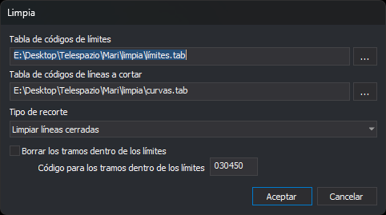

# LIMPIA
<!-- id: limpia -->

Corta las líneas que atraviesan el contorno de unos límites (textos, líneas o polígonos) y borra o recodifica lo que queda dentro de esos límites.

## Parámetros

| Número de parámetro | Parámetro | Descripción |
| :--- | :--- | :--- |
| 1 | Tipo de recorte | `0`: limpiar textos. `1`: limpiar líneas cerradas. `2`: limpiar líneas abiertas o cerradas. Con otro valor, la orden no modifica el dibujo |
| 2 | Tabla de códigos de límites | Ruta del archivo de texto con los códigos de las entidades que hacen de límite |
| 3 | Tabla de códigos de líneas a cortar | Ruta del archivo de texto con los códigos de las entidades que se cortan con los límites |
| 4 | Borrar los tramos dentro de los límites | `1`: borra lo que queda dentro de los límites. Con otro valor, lo conserva |
| 5 | Código para los tramos dentro de los límites | Código que se aplica a lo que queda dentro de los límites cuando el parámetro 4 no vale `1`. Admite los comodines `?` y `*` |

Sin parámetros, la orden muestra el cuadro de diálogo. Con parámetros hay que indicar los cinco. Con menos de cinco, la orden emite un sonido de error, muestra el aviso _Faltan parámetros_ con el texto _Número de parámetros incorrecto_ y termina. Los parámetros a partir del sexto se ignoran. Con parámetros, la orden no muestra el cuadro de diálogo ni cambia los valores que recuerda el cuadro.

## Observaciones

### Tablas de códigos

Cada tabla es un archivo de texto en UTF-8, con o sin BOM. La orden toma como código la primera palabra de cada línea; las palabras se separan con espacios, tabuladores, comas o el signo `=`. Las líneas vacías se ignoran. Los códigos admiten los comodines `*` y `?`, y una entidad cumple la tabla si cualquiera de sus códigos coincide con alguno de la tabla.

Si una tabla no se puede abrir, la orden muestra el mensaje _Error al abrir el archivo de tabla de códigos de límites_ o _Error al abrir el archivo de tabla de líneas a recortar_ y no modifica el dibujo. Si una tabla no contiene ningún código, la orden termina sin modificar el dibujo y sin mostrar ningún mensaje.

### Límites

Hacen de límite las entidades no borradas, visibles y dentro de la zona de interés cuyo código está en la tabla de límites:

* **Limpiar textos**: los textos. El límite es el rectángulo que ocupa cada texto.
* **Limpiar líneas cerradas**: las líneas y los polígonos cuyo primer y último vértice coinciden en X, Y y Z.
* **Limpiar líneas abiertas o cerradas**: las líneas y los polígonos. Si una línea no está cerrada en planta, la orden usa como límite una copia cerrada uniendo el último vértice con el primero, sin modificar la línea original.

En los polígonos, lo que queda dentro de un hueco se considera fuera del límite.

### Entidades que se cortan

La orden procesa los límites uno detrás de otro. Para cada límite, toma las entidades no borradas cuyo código está en la tabla de líneas a cortar, aunque no estén visibles o estén fuera de la zona de interés:

* **Líneas**: si cruzan el límite, la orden las parte en los puntos de corte. Cada tramo queda dentro o fuera según el punto medio de su segmento central; un tramo sobre el borde del límite cuenta como dentro. Los tramos de fuera sustituyen a la línea original con sus mismos códigos. Una línea que no cruza el límite queda entera dentro o entera fuera.
* **Puntos, complejos puntuales y textos**: quedan dentro si su punto de inserción está dentro del límite o sobre su borde.
* **Multipuntos e imágenes**: quedan dentro si todos sus vértices están dentro del límite.
* **Polígonos y complejos**: no se cortan ni se borran.

Con lo que queda dentro del límite, la orden hace lo siguiente:

* Si **Borrar los tramos dentro de los límites** está marcada (o el parámetro 4 vale `1`), lo borra.
* Si no está marcada y el código está vacío, conserva los tramos interiores con el código de la línea original. El resultado es que la línea queda partida en el borde del límite.
* Si no está marcada y hay código, sustituye los tramos interiores y las entidades que quedan dentro por copias con el código nuevo. El código nuevo se compone carácter a carácter sobre el primer código de la entidad: `?` conserva el carácter original y `*` conserva el resto del código original. Por ejemplo, con el código `??9*`, el código `020101` pasa a `029101`; con `030450`, cualquier código pasa a `030450`. La entidad resultante tiene un único código.

Todos los cambios de una ejecución se deshacen de una vez con la orden de deshacer.

### Cuadro de diálogo

* **Tabla de códigos de límites**: ruta de la tabla de límites. El botón **...** abre un cuadro para elegir el archivo, con los filtros _Archivos de tablas_ (`*.tab`) y _Todos los archivos_.
* **Tabla de códigos de líneas a cortar**: ruta de la tabla de las entidades que se cortan, con su botón **...**. Los dos botones abren el cuadro en la carpeta de la última tabla elegida con cualquiera de ellos.
* **Tipo de recorte**: _Limpiar textos_, _Limpiar líneas cerradas_ o _Limpiar líneas abiertas o cerradas_. Corresponde a los valores `0`, `1` y `2` del primer parámetro.
* **Borrar los tramos dentro de los límites**: si está marcada, la orden borra lo que queda dentro de los límites, y el campo **Código para los tramos dentro de los límites** se deshabilita.
* **Código para los tramos dentro de los límites**: código que se aplica a lo que queda dentro de los límites. Solo está habilitado con la casilla anterior desmarcada.

**Aceptar** guarda los valores y ejecuta la orden. Si alguna de las tablas no se puede abrir, la orden muestra el mensaje de error y el cuadro sigue abierto para corregir la ruta. **Cancelar** cierra el cuadro sin modificar el dibujo ni guardar los valores.

Digi3D.AI recuerda los valores del cuadro entre ejecuciones. La primera vez, las rutas y el código están vacíos, el tipo de recorte es _Limpiar textos_ y la casilla está marcada.

## Características de la orden

| Tipo de orden | [Orden inmediata](limpia.md) |
| :--- | :--- |
| Repite automáticamente | No |
| Opción del menú donde aparece la orden | Editar/Más/Recortar polilíneas dentro de polígonos o del área de influencia de un texto... |
| Barra de herramientas en la que aparece la orden | [Eliminar y recuperar](/digi3d-ai/referencia/barras-de-herramientas/eliminar-y-recuperar.md) |
| Extensión | DigiNG.OrdenesStandard.dll |
| Variables relacionadas | No tiene variables relacionadas |
| Órdenes relacionadas | [BORRA\_COD\_V](/digi3d-ai/referencia/ventana-de-dibujo/ordenes/b/borra-cod-v.md) [PARTIR\_LINEAS\_QUE\_CRUZAN](/digi3d-ai/referencia/ventana-de-dibujo/ordenes/p/partir-lineas-que-cruzan.md) |
| Nombre interno | {417FAB22-3EA8-4629-A51C-0EF65F253206} |
