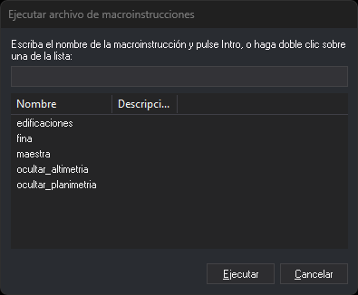

# MACROINSTRUCCIONES
<!-- id: macroinstrucciones-2 -->

Ejecuta macroinstrucciones, también llamadas arrobas.

## Parámetros

No admite parámetros.

## Cuadro de diálogo Ejecutar archivo de macroinstrucciones

Esta orden solicita la macroinstrucción a ejecutar en este cuadro de diálogo.

* **Nombre**: escribe el nombre de la macroinstrucción, sin la arroba, y pulsa Intro o el botón **Ejecutar**. Mientras escribes, la lista muestra solo las macroinstrucciones cuyo nombre o descripción contienen el texto.
* **Lista**: haz doble clic sobre una macroinstrucción para ejecutarla. La lista muestra:
  * las macroinstrucciones de la [tabla de códigos](../../../editor-de-tablas-de-codigos/pestanas/macroinstrucciones.md), con su descripción;
  * los archivos de macroinstrucciones (`@nombre`) del [directorio de macroinstrucciones](../../../cuadros-de-dialogo/configuracion/diging/directorio-de-macroinstrucciones.md). Si la primera línea del archivo es un [comentario](../../../ordenes/formas-de-ejecutar-una-orden/ejecutar-una-orden-desde-la-linea-de-comandos/macroinstrucciones.md) (empieza por `//` o por `#`), su texto se muestra como descripción.

## Características de la orden

| Tipo de orden | [Orden interactiva](macroinstrucciones.md) |
| :--- | :--- |
| Repite automáticamente | No |
| Opción del menú donde aparece la orden | _Esta orden no tiene asociada ninguna opción de menú_ |
| Barra de herramientas en la que aparece la orden | _Esta orden no tiene asociado ningún botón en ninguna barra de herramientas_ |
| Extensión | DigiNG.OrdenesStandard.dll |
| Variables relacionadas | No tiene variables relacionadas |
| Órdenes relacionadas | No tiene órdenes relacionadas |
| Nombre interno | {B1A86A33-6B33-40b2-8C84-693696E7418B} |
