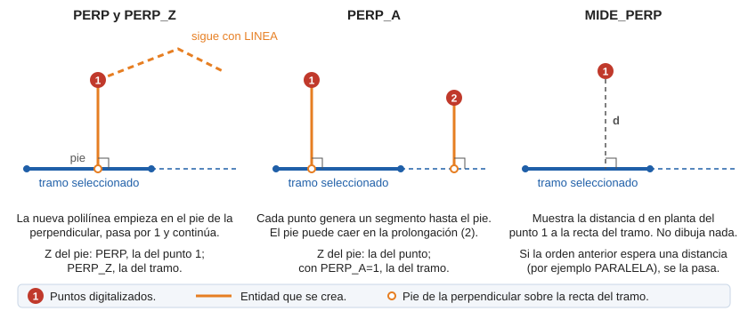

# MIDE\_PERP

Mide la perpendicular a un segmento seleccionado.

## Parámetros.

No admite parámetros.

## Observaciones

Selecciona un tramo y digitaliza un punto: la orden muestra la distancia en planta del punto a la recta del tramo y no dibuja nada. Si la orden que estaba activa espera una distancia, como [PARALELA](/digi3d-ai/referencia/ventana-de-dibujo/ordenes/p/paralela.md), recibe la distancia medida.

## Características de la orden

| Tipo de orden | [Orden interactiva](mide-perp.md) |
| :--- | :--- |
| Repite automáticamente | No |
| Opción del menú donde aparece la orden | Inmediato/Medir una distancia perpendicular |
| Barra de herramientas en la que aparece la orden | _Esta orden no tiene asociado ningún botón en ninguna barra de herramientas_ |
| Extensión | DigiNG.OrdenesStandard.dll |
| Variables relacionadas | No tiene variables relacionadas |
| Nombre interno | {0018D658-03C5-47BE-B795-21D43934C4B9} |

