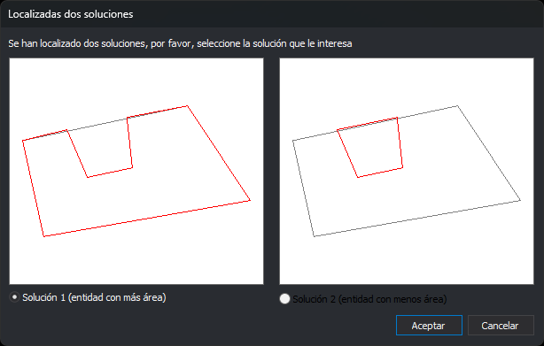

# MOD
<!-- id: mod -->

Modifica el trazado geométrico de una entidad en XY.

## Parámetros

| Número de parámetro | Descripción | Opcional |
| :--- | :--- | :--- |
| 1 | Cualquier valor. Si se especifica, la entidad modificadora no se descarta tras la modificación y la orden [LINEA](/digi3d-ai/referencia/ventana-de-dibujo/ordenes/l/linea.md) sigue activa con ella | Sí |

## Observaciones

Tienes que dibujar una entidad que represente el nuevo trazado del elemento que quieres modificar, y sin dar por terminada ésta, ejecuta la orden MOD. El nuevo tramo dibujado debería engancharse en los puntos apropiados de la entidad a modificar.

Si no se está registrando ninguna línea, la orden muestra el aviso «No se está registrando ninguna línea» y termina. La entidad que se modifica tiene que ser una línea o un polígono.

Digi3D.AI proyecta en perpendicular el primer y el último vértice de la entidad modificadora sobre el segmento más cercano de la entidad a modificar, y sustituye el tramo comprendido entre esas proyecciones por los vértices de la entidad modificadora. Los puntos de corte no se añaden como vértices: el tramo nuevo se une a los vértices de la entidad original. Si solo uno de los dos extremos se proyecta sobre la entidad, la orden sustituye el principio o el final de la entidad.

Si los dos extremos de la entidad modificadora quedan sobre la entidad modificada, la coordenada Z de sus vértices se interpola linealmente entre la Z de la entidad modificada en el punto inicial y en el punto final. Si solo se proyecta un extremo, la Z no cambia. Si no deseas modificar las cotas, utiliza la orden [MOD\_Z](/digi3d-ai/referencia/ventana-de-dibujo/ordenes/m/mod-z.md).

Independientemente del código utilizado al dibujar la entidad modificadora, éste se cambia por el de la entidad modificada.

### Ejemplo:

Esta orden permite "arreglar" curvas de nivel que se corten. Sólo tienes que dibujar el tramo de la curva que quieres modificar. Podrías hacer esto con la orden EDITAR, pero es un proceso más lento, ya que requiere modificar los vértices de interés de uno en uno.

### Modificar una entidad cerrada

Si la entidad que se modifica está cerrada (o es el contorno o un hueco de un polígono) y los dos extremos de la entidad modificadora quedan sobre ella, el nuevo tramo divide la entidad en dos recintos y hay dos soluciones posibles. Digi3D.AI muestra el cuadro de diálogo **Localizadas dos soluciones** para que elijas una:

* Cada dibujo muestra la entidad original con un color atenuado y, en rojo, el contorno de una de las soluciones.
* **Solución 1**, a la izquierda, es la de más área y está seleccionada por defecto. **Solución 2**, a la derecha, es la de menos área.
* **Aceptar** sustituye la entidad por la solución seleccionada.
* **Cancelar** deja la entidad sin cambios. Si MOD se ejecutó sin parámetro, la entidad modificadora se descarta y termina la orden LINEA. Con parámetro, LINEA sigue activa con la entidad modificadora.

Si se modifica el contorno de un polígono con huecos, una solución solo es válida si todos los huecos quedan dentro de su contorno. Si solo una de las dos es válida, se aplica sin mostrar el cuadro. Si no lo es ninguna, se muestra el mensaje «No se ha podido realizar la modificación porque el polígono dejaría huecos fuera del contorno exterior.» y la entidad no cambia.

Las órdenes MOD\_Z, MOD\_MÚLTIPLE y MOD\_Z\_MÚLTIPLE muestran el mismo cuadro en este caso.

## Características de la orden

| Tipo de orden | [Orden interactiva](/digi3d-ai/referencia/ventana-de-dibujo/ordenes-interactivas.md) |
| :--- | :--- |
| Repite automáticamente | No |
| Opción del menú donde aparece la orden | Editar/Polilíneas/Modificar en XY una polilínea existente con la que se está registrando |
| Barra de herramientas en la que aparece la orden | Modifica |
| Extensión | DigiNG.OrdenesStandard.dll |
| Variables relacionadas | No tiene variables relacionadas |
| Órdenes relacionadas | [MOD\_MÚLTIPLE](/digi3d-ai/referencia/ventana-de-dibujo/ordenes/m/mod-multiple.md) [MOD\_Z](/digi3d-ai/referencia/ventana-de-dibujo/ordenes/m/mod-z.md) [MOD\_Z\_MÚLTIPLE](/digi3d-ai/referencia/ventana-de-dibujo/ordenes/m/mod-z-multiple.md) |
| Nombre interno | {0A6E6F7E-3A79-4726-BFAA-50A552634A5B} |

