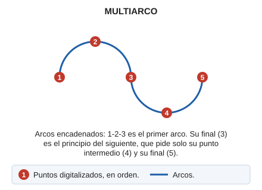

# MULTIARCO

Dibuja arcos de forma consecutiva y unidos entre sí.

## Parámetros

No admite parámetros.

## Observaciones

El último punto de un arco y el primero del siguiente es el mismo.

## Características de la orden

| Tipo de orden | [Orden interactiva](multiarco.md) |
| :--- | :--- |
| Repite automáticamente | No |
| Opción del menú donde aparece la orden | Dibujar/Secuencia de arcos |
| Barra de herramientas en la que aparece la orden | Polilíneas |
| Extensión | DigiNG.OrdenesStandard.dll |
| Variables relacionadas | [PITA](/digi3d-ai/referencia/ventana-de-dibujo/variables/p/pita.md) — activa o desactiva las señales acústicas [REPITE](/digi3d-ai/referencia/ventana-de-dibujo/variables/r/repite.md) — repite la última orden ejecutada |
| Órdenes relacionadas | [ARCO](/digi3d-ai/referencia/ventana-de-dibujo/ordenes/a/arco.md) [ARCO\_TANGENTE](/digi3d-ai/referencia/ventana-de-dibujo/ordenes/a/arco-tangente.md) |
| Nombre interno | {439FBB9E-ED74-4134-8B62-7C5650A55784} |

