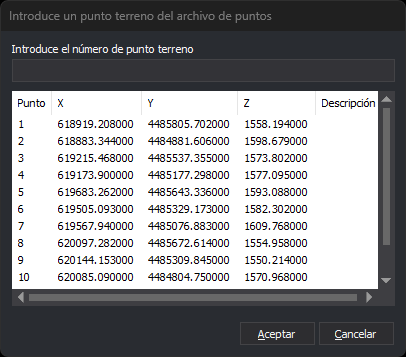

# N
<!-- id: n-2 -->

Envía a la orden activa las coordenadas de un punto del archivo de puntos. El punto se elige por su nombre en un cuadro de diálogo.

## Parámetros

No admite parámetros.

## Observaciones

### Archivo de puntos

La orden lee el archivo de puntos asignado con [FICHERO\_P](/digi3d-ai/referencia/ventana-de-dibujo/ordenes/f/fichero-p.md). Las órdenes [AGREGA](/digi3d-ai/referencia/ventana-de-dibujo/ordenes/a/agrega.md) e [IR\_A\_PUNTO\_APOYO](/digi3d-ai/referencia/ventana-fotogrametrica/ordenes/i/ir-a-punto-apoyo.md) usan el mismo archivo. Si no hay ningún archivo asignado, o el archivo asignado no existe, la orden muestra un cuadro de diálogo para seleccionarlo y lo deja asignado para las siguientes ejecuciones. Si cancelas ese cuadro, la orden termina.

La orden lee el archivo una vez, al empezar. Los puntos que añadas después con AGREGA aparecen en la lista la próxima vez que ejecutes N.

Cada línea del archivo contiene los datos de un punto, separados entre sí por comas, espacios en blanco, tabuladores o el signo `=`. La orden ignora las líneas con menos de cuatro datos:

| Dato | Descripción | Valores | Opcional |
| :--- | :--- | :--- | :--- |
| Primer dato | Nombre del punto. Si contiene espacios, comas o el signo `=`, va entre comillas dobles. AGREGA escribe las comillas | Texto | No |
| Segundo dato | Coordenada X | Número real | No |
| Tercer dato | Coordenada Y | Número real | No |
| Cuarto dato | Coordenada Z | Número real | No |
| Quinto dato | Descripción del punto: el resto de la línea, espacios incluidos. Si va entre comillas, se quitan las comillas. Si AGREGA guardó el punto seleccionando una entidad con código, el código va delante de la descripción | Texto | Si |

### Cuadro de diálogo

El cuadro _Introduce un punto terreno del archivo de puntos_ muestra los puntos del archivo en una lista con las columnas _Punto_, _X_, _Y_, _Z_ y _Descripción_. Escribe el nombre del punto en el campo _Introduce el número de punto terreno_, o haz clic en una fila de la lista, y pulsa _Aceptar_.

La orden busca el punto en este orden:

1. Si has hecho clic en una fila y no has cambiado el campo, el punto de esa fila.
2. Un punto cuyo nombre es igual al texto del campo. Distingue mayúsculas y minúsculas.
3. Si el texto es una sola palabra entre comillas, un punto con ese nombre sin las comillas.
4. Si el texto es un número entero, el primer punto cuyo nombre es ese número: `5` encuentra el punto `005`.

Si encuentra el punto, la orden desplaza el cursor a sus coordenadas y las envía como un punto a la orden activa. La orden activa recibe solo las coordenadas, no el nombre ni la descripción del punto.

Si no hay ninguna orden activa, N ejecuta antes la orden que corresponde al código activo:

- las órdenes asociadas al código en la tabla de códigos, si las tiene;
- [COTA](/digi3d-ai/referencia/ventana-de-dibujo/ordenes/c/cota.md), si el código activo coincide con el primer código de [COD\_COTAS](/digi3d-ai/referencia/ventana-de-dibujo/ordenes/c/cod-cotas.md);
- [LINEA](/digi3d-ai/referencia/ventana-de-dibujo/ordenes/l/linea.md), si el código es lineal o virtual;
- [PUNTO](/digi3d-ai/referencia/ventana-de-dibujo/ordenes/p/punto.md), en los demás casos.

### Rangos de puntos

Si escribes dos números enteros separados por un espacio o una coma, por ejemplo `10 20`, y ningún punto se llama así, la orden envía a la orden activa, uno tras otro, los puntos cuyo nombre es un número del rango. Los envía en orden ascendente si el primer número es menor que el segundo, y en orden descendente si no. Los números del rango que no están en el archivo se saltan. En un rango la orden no desplaza el cursor.

### Mensajes

Si no encuentra el punto, la orden muestra el mensaje _Error: No se pudo localizar el punto «nombre» en el archivo «archivo»_. En un rango, si falta uno de los dos extremos, muestra _Error: No se pudo localizar o el punto «inicio» o el punto «final» en el archivo «archivo»_ y no envía ningún punto.

Mientras se muestra el cuadro, la línea de órdenes indica _Digitaliza punto_.

Si pulsas _Cancelar_, o _Aceptar_ con el campo vacío, la orden termina.

Si la variable [REPITE](/digi3d-ai/referencia/ventana-de-dibujo/variables/r/repite.md) está activada, el cuadro de diálogo se vuelve a mostrar tras cada punto, también después de un mensaje de error. Si no está activada, la orden termina.

## Características de la orden

| Tipo de orden | [Orden interactiva](/digi3d-ai/referencia/ventana-de-dibujo/ordenes-interactivas.md) |
| :--- | :--- |
| Repite automáticamente | Si |
| Opción del menú donde aparece la orden | _Esta orden no tiene asociada ninguna opción de menú_ |
| Barra de herramientas en la que aparece la orden | _Esta orden no tiene asociado ningún botón en ninguna barra de herramientas_ |
| Extensión | DigiNG.OrdenesStandard.dll |
| Variables relacionadas | [REPITE](/digi3d-ai/referencia/ventana-de-dibujo/variables/r/repite.md) — repite la última orden ejecutada |
| Órdenes relacionadas | [AGREGA](/digi3d-ai/referencia/ventana-de-dibujo/ordenes/a/agrega.md) [COD\_COTAS](/digi3d-ai/referencia/ventana-de-dibujo/ordenes/c/cod-cotas.md) [FICHERO\_P](/digi3d-ai/referencia/ventana-de-dibujo/ordenes/f/fichero-p.md) [IR\_A\_PUNTO\_APOYO](/digi3d-ai/referencia/ventana-fotogrametrica/ordenes/i/ir-a-punto-apoyo.md) |
| Nombre interno | {B4C60C59-89B2-4402-8C5F-307DD0C8EE86} |
