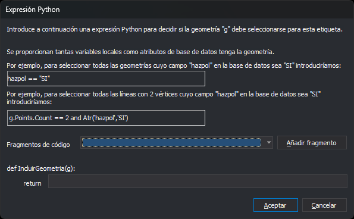

# ON\_EXPRESIÓN\_PYTHON
<!-- id: on-expresion-python -->

Muestra las geometrías para las que una expresión Python devuelve verdadero. La orden evalúa la expresión con cada geometría de todos los archivos de dibujo cargados y quita la marca de oculta a las que la cumplen.

## Parámetros

| Número de parámetro | Descripción | Opcional |
| :--- | :--- | :--- |
| 1 | Expresión Python. Todo el texto que sigue al signo `=` forma la expresión. Se ignoran los espacios del principio y del final.<br>o<br>Nombres de [selecciones](/digi3d-ai/referencia/editor-de-tablas-de-codigos/pestanas/selecciones.md) de la tabla de códigos, cada uno precedido de `#` y separados por espacios. | Sí. Sin parámetros, la orden muestra el cuadro de diálogo **Expresión Python**. |

La orden usa nombres de selecciones solo si el primer parámetro empieza por `#`. En ese caso ignora los parámetros que no empiezan por `#`. Los nombres no distinguen mayúsculas de minúsculas. Un nombre que no existe en la tabla de códigos se ignora sin aviso. Si el nombre lleva espacios, se escribe entre comillas: `ON_EXPRESION_PYTHON="#Zonas verdes"`.

## La expresión

* Es una única expresión de Python, no un guion: no admite `import`, asignaciones ni bloques.
* La variable `g` contiene la geometría que se está evaluando. Es un objeto [Geometry](/digi3d-ai/programacion/python/referencia/digi21.base/geometry.md) cuyo tipo concreto es `Point`, `Text`, `Line`, `Polygon` o `Complex`.
* No se crea ninguna variable por atributo. Los atributos de base de datos del primer código están en el diccionario `g.codes[0].attributes` (nombre del campo → valor). Si los atributos aún no se han leído, leer `attributes` consulta la base de datos.
* La expresión debe devolver `True` o `False`. También se acepta `None` (falso) o un número (verdadero si es distinto de 0). Una cadena, una lista u otro tipo produce un error.
* La expresión puede llamar a las funciones definidas en el [entorno Python](/digi3d-ai/referencia/editor-de-tablas-de-codigos/pestanas/entorno-python.md) de la tabla de códigos.

## Cuadro de diálogo



El cuadro de diálogo es el mismo para [OFF\_EXPRESIÓN\_PYTHON](/digi3d-ai/referencia/ventana-de-dibujo/ordenes/o/off_expresion_python.md), [ON\_SOLO\_EXPRESIÓN\_PYTHON](/digi3d-ai/referencia/ventana-de-dibujo/ordenes/o/on_solo_expresion_python.md) y [SELECCIONA\_EXPRESION\_PYTHON](/digi3d-ai/referencia/ventana-de-dibujo/ordenes/s/selecciona_expresion_python.md). Escribe la expresión en el campo que sigue a `return`. El cuadro de diálogo no recuerda la expresión de la vez anterior.

Para insertar un fragmento, elígelo en el desplegable **Fragmentos de código** y pulsa **Añadir fragmento**. El fragmento se añade al final de la expresión. Los fragmentos son:

| Fragmento | Significado |
| :--- | :--- |
| `==`, `!=`, `<`, `>`, `<=`, `>=`, `and`, `and not`, `not`, `True`, `False` | Operadores y valores de Python |
| `type(g).__name__ == 'Point'` (también `'Line'`, `'Text'`, `'Polygon'` y `'Complex'`) | Tipo de la geometría. Un polígono no es `'Line'`. |
| `g.has_code('code')` | La geometría tiene el código indicado. Admite los comodines `*` y `?`. |
| `len(g)` | Número de vértices |
| `g[0]` | Coordenadas `(x, y, z)` del primer vértice |
| `g.codes[0].attributes.get('field')` | Valor del campo `field` del primer código, o `None` si no existe |
| `g.area`, `g.perimeter_2d`, `g.closed` | Área, perímetro en planta y si está cerrada. Solo en líneas y polígonos; `closed` también en complejos. |
| `g.text` | Cadena de un texto. Solo en textos. |

Sustituye `code` y `field` por el código y el campo reales.

## Errores

Si la expresión tiene un error de sintaxis, o falla con alguna geometría, Digi3D.AI muestra un mensaje con el error de Python. Por ejemplo, falla `g.area` en un punto, o `attributes['campo']` si el campo no existe. El mensaje aparece una vez por cada archivo de dibujo cargado, y en ese archivo la orden no cambia ninguna geometría.

Para evitar errores:

* Comprueba antes el tipo. `and` solo evalúa la segunda condición si la primera es verdadera: `type(g).__name__ == 'Line' and g.area > 100`.
* Lee los campos con `.get('campo')`, que devuelve `None` si el campo no existe.

### Ejemplos

Para mostrar las geometrías que tienen exactamente 3 vértices:

```text
ON_EXPRESION_PYTHON=len(g) == 3
```

Para mostrar las geometrías cuyo primer código es '010101', que tienen 7 vértices y cuyo campo Propietario de la base de datos vale 'Dylan':

```text
ON_EXPRESION_PYTHON=g.codes[0].code == '010101' and len(g) == 7 and g.codes[0].attributes.get('Propietario') == 'Dylan'
```

Para mostrar las geometrías que cumplen la selección "Edificios" de la tabla de códigos:

```text
ON_EXPRESION_PYTHON=#Edificios
```

Para mostrar las geometrías que cumplen la selección "Edificios" o la selección "Deportivo":

```text
ON_EXPRESION_PYTHON=#Edificios #Deportivo
```

## Observaciones

* La orden actúa sobre todas las geometrías de todos los archivos de dibujo cargados, incluidas las borradas.
* Mostrar u ocultar por expresión es una marca de cada geometría. Es independiente de la visibilidad por código: una geometría cuyo código está apagado sigue sin dibujarse.
* Las geometrías ocultas no se dibujan en la ventana de dibujo ni en la ventana fotogramétrica. [VER\_TODAS\_ENTIDADES](/digi3d-ai/referencia/ventana-de-dibujo/ordenes/v/ver-todas-entidades.md) quita la marca de oculta a todas las geometrías.

## Características de la orden

| Tipo de orden | Orden inmediata |
| :--- | :--- |
| Repite automáticamente | No |
| Opción del menú donde aparece la orden | Ver/Las que cumplan con expresión Python... |
| Barra de herramientas en la que aparece la orden | _Esta orden no tiene asociado ningún botón en ninguna barra de herramientas_ |
| Extensión | DigiNG.OrdenesStandard.dll |
| Variables relacionadas | No tiene variables relacionadas |
| Órdenes relacionadas | [OFF\_EXPRESIÓN\_PYTHON](/digi3d-ai/referencia/ventana-de-dibujo/ordenes/o/off_expresion_python.md)<br>[OFF\_TODO](/digi3d-ai/referencia/ventana-de-dibujo/ordenes/o/off_todo.md)<br>[ON\_SOLO\_EXPRESIÓN\_PYTHON](/digi3d-ai/referencia/ventana-de-dibujo/ordenes/o/on_solo_expresion_python.md)<br>[SELECCIONA\_EXPRESION\_PYTHON](/digi3d-ai/referencia/ventana-de-dibujo/ordenes/s/selecciona_expresion_python.md)<br>[VER\_TODAS\_ENTIDADES](/digi3d-ai/referencia/ventana-de-dibujo/ordenes/v/ver-todas-entidades.md) |
| Nombre interno | {CC07AD2F-1CB4-485E-B8D0-A8B1F449DCB0} |
