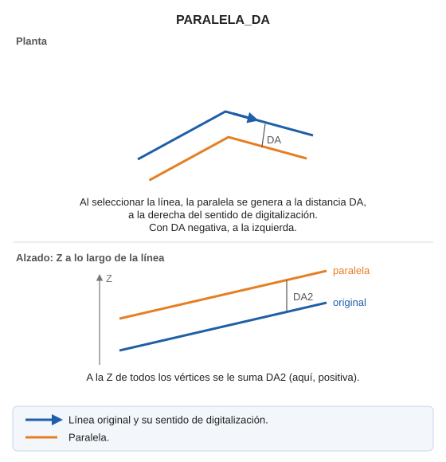

# PARALELA\_DA
<!-- id: paralela-da -->

Dibuja una paralela con los parámetros especificados en la variable Distancia Activa.

## Parámetros

No admite parámetros.

## Observaciones

Al seleccionar la línea, la paralela se genera a la [distancia activa DA](/digi3d-ai/referencia/ventana-de-dibujo/variables/d/da.md), a la derecha del sentido de digitalización de la línea. Con DA negativa sale a la izquierda. A la Z de todos los vértices se le suma la distancia DA2.

## Características de la orden

| Tipo de orden | [Orden interactiva](paralela-da.md) |
| :--- | :--- |
| Repite automáticamente | Si |
| Opción del menú donde aparece la orden | _Esta orden no tiene asociada ninguna opción de menú_ |
| Barra de herramientas en la que aparece la orden | _Esta orden no tiene asociado ningún botón en ninguna barra de herramientas_ |
| Extensión | DigiNG.OrdenesStandard.dll |
| Variables relacionadas | [DA](/digi3d-ai/referencia/ventana-de-dibujo/variables/d/da.md) — distancia activa [REPITE](/digi3d-ai/referencia/ventana-de-dibujo/variables/r/repite.md) — repite la última orden ejecutada |
| Órdenes relacionadas | [PARALELA](/digi3d-ai/referencia/ventana-de-dibujo/ordenes/p/paralela.md) [PARALELA\_Z](/digi3d-ai/referencia/ventana-de-dibujo/ordenes/p/paralela-z.md) |
| Nombre interno | {6C27BAFC-420A-4CFE-8F83-A36CBEFC56C0} |
