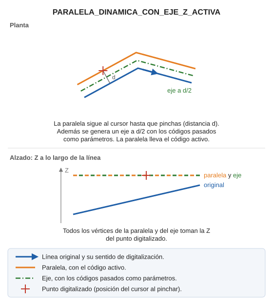

# PARALELA\_DINAMICA\_CON\_EJE\_Z\_ACTIVA

Dibuja una paralela dinámica con el código/s activo/s y un eje entre las dos paralelas con el código/s pasado/s por parámetros. Todos los vértices de la paralela y del eje toman la Z del punto digitalizado.

## Parámetros

| Número de parámetro | Descripción | Opcional |
| :--- | :--- | :--- |
| 1 y siguientes | Códigos del eje. | Sí |

## Observaciones

Funciona como la paralela dinámica: seleccionas la línea y la paralela sigue al cursor hasta que pinchas. Además, la orden dibuja un eje a mitad de distancia entre la línea original y la paralela, con los códigos pasados como parámetros. La paralela se genera con el código activo.
Todos los vértices de la paralela y del eje toman la Z del punto digitalizado.

## Características de la orden

| Tipo de orden | [Orden interactiva](paralela-dinamica-con-eje-z-activa.md) |
| :--- | :--- |
| Repite automáticamente | Si |
| Opción del menú donde aparece la orden | Dibujar/Más/Paralela dinámica con eje con Z activa |
| Barra de herramientas en la que aparece la orden | Paralelas |
| Extensión | DigiNG.OrdenesStandard.dll |
| Variables relacionadas | [REPITE](/digi3d-ai/referencia/ventana-de-dibujo/variables/r/repite.md) — repite la última orden ejecutada |
| Nombre interno | {CBC7D1C8-E3D2-4B9B-B1F5-798C79372A6E} |
