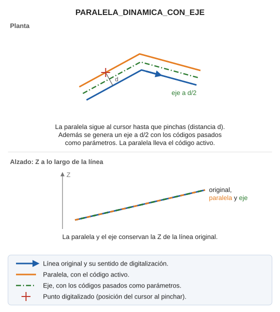

# PARALELA\_DINAMICA\_CON\_EJE
<!-- id: paralela-dinamica-con-eje -->

Dibuja una paralela dinámica con los códigos activos y, entre la línea original y la paralela, un eje con los códigos indicados como parámetros.

## Parámetros

| Número de parámetro | Descripción | Opcional |
| :--- | :--- | :--- |
| 1 y siguientes | Códigos del eje. | Sí |

## Observaciones

Selecciona la línea y haz clic para fijar la posición de la paralela; hasta que hagas clic, la posición de la paralela cambia al mover el cursor. Además, la orden dibuja un eje a mitad de distancia entre la línea original y la paralela, con los códigos pasados como parámetros. La paralela se genera con el código activo.
La Z de la paralela y del eje es la de la línea original.

## Características de la orden

| Tipo de orden | [Orden interactiva](/digi3d-ai/referencia/ordenes/ordenes-interactivas.md) |
| :--- | :--- |
| Repite automáticamente | Sí |
| Opción del menú donde aparece la orden | Dibujar/Más/Paralela dinámica con eje en XY |
| Barra de herramientas en la que aparece la orden | Paralelas |
| Extensión | DigiNG.OrdenesStandard.dll |
| Implementación | Nativa |
| Variables relacionadas | [REPITE](/digi3d-ai/referencia/ventana-de-dibujo/variables/r/repite.md) — repite la última orden ejecutada |
| Órdenes relacionadas | [PARALELA\_DINÁMICA](/digi3d-ai/referencia/ventana-de-dibujo/ordenes/p/paralela-dinamica.md) [PARALELA\_DINAMICA\_CON\_EJE\_Z](/digi3d-ai/referencia/ventana-de-dibujo/ordenes/p/paralela-dinamica-con-eje-z.md) [PARALELA\_DINAMICA\_CON\_EJE\_Z\_ACTIVA](/digi3d-ai/referencia/ventana-de-dibujo/ordenes/p/paralela-dinamica-con-eje-z-activa.md) |
| Nombre interno | {8455DA79-71E9-4A5D-B5DB-2CF259F31F87} |
