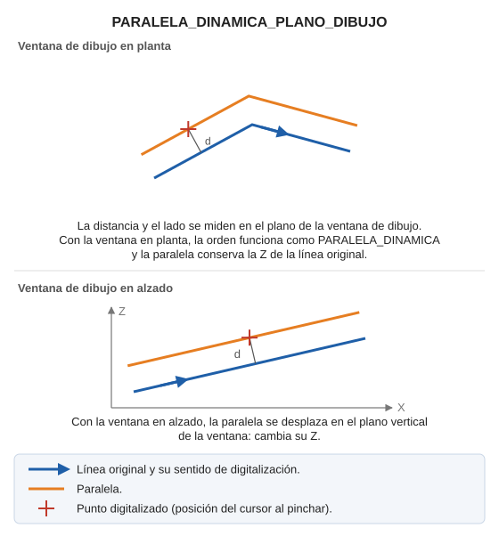

# PARALELA\_DINAMICA\_PLANO\_DIBUJO

Realiza una paralela dinámica en el plano que tenga la ventana de dibujo.

## Parámetros

No admite parámetros.

## Características de la orden

| Tipo de orden | [Orden interactiva](paralela-dinamica-plano-dibujo.md) |
| :--- | :--- |
| Repite automáticamente | Si |
| Opción del menú donde aparece la orden | _Esta orden no tiene asociada ninguna opción de menú_ |
| Barra de herramientas en la que aparece la orden | _Esta orden no tiene asociado ningún botón en ninguna barra de herramientas_ |
| Extensión | DigiNG.OrdenesStandard.dll |
| Variables relacionadas | [REPITE](/digi3d-ai/referencia/ventana-de-dibujo/variables/r/repite.md) — repite la última orden ejecutada |
| Órdenes relacionadas | [PARALELA\_DINÁMICA](/digi3d-ai/referencia/ventana-de-dibujo/ordenes/p/paralela-dinamica.md) [PARALELA\_DINÁMICA\_XYZ](/digi3d-ai/referencia/ventana-de-dibujo/ordenes/p/paralela-dinamica-xyz.md) [PARALELA\_DINÁMICA\_Z\_FIJA](/digi3d-ai/referencia/ventana-de-dibujo/ordenes/p/paralela-dinamica-z-fija.md) |
| Nombre interno | {278C9520-3941-49B6-B983-1544BF7AC151} |
