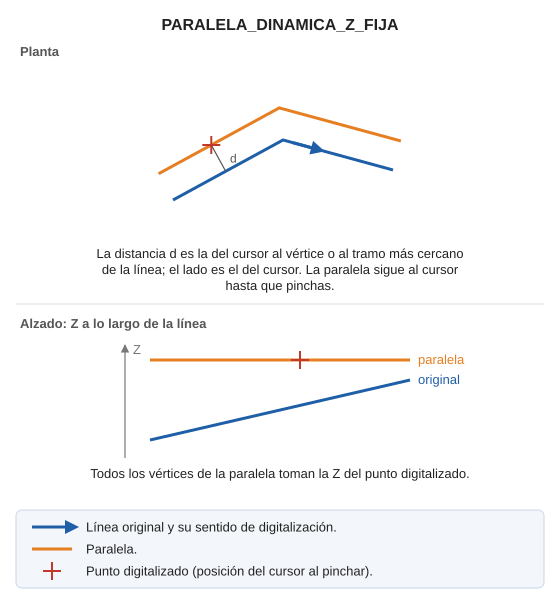

# PARALELA\_DINÁMICA\_Z\_FIJA

Dibuja una línea paralela a una entidad a la distancia que especifique el operador, con una determinada Z.

## Parámetros

Esta orden no admite parámetros, ya que la distancia a la que se va a generar la paralela se selecciona con un clic en la pantalla de dibujo.

## Observaciones

Las paralelas las va a generar con el código que esté activo en el momento de ejecutar la orden.

Todos los vértices de la paralela toman la Z del punto digitalizado.

## Características de la orden

| Tipo de orden | [Orden interactiva](paralela-dinamica-z-fija.md) |
| :--- | :--- |
| Repite automáticamente | Si |
| Opción del menú donde aparece la orden | Dibujar/Más/Paralela dinámica con Z activa |
| Barra de herramientas en la que aparece la orden | Paralela |
| Extensión | DigiNG.OrdenesStandard.dll |
| Variables relacionadas | [REPITE](/digi3d-ai/referencia/ventana-de-dibujo/variables/r/repite.md) — repite la última orden ejecutada |
| Órdenes relacionadas | [PARALELA\_DINÁMICA](/digi3d-ai/referencia/ventana-de-dibujo/ordenes/p/paralela-dinamica.md) [PARALELA\_DINAMICA\_CON\_EJE\_Z\_ACTIVA](/digi3d-ai/referencia/ventana-de-dibujo/ordenes/p/paralela-dinamica-con-eje-z-activa.md) [PARALELA\_DINAMICA\_PLANO\_DIBUJO](/digi3d-ai/referencia/ventana-de-dibujo/ordenes/p/paralela-dinamica-plano-dibujo.md) [PARALELA\_DINÁMICA\_XYZ](/digi3d-ai/referencia/ventana-de-dibujo/ordenes/p/paralela-dinamica-xyz.md) |
| Nombre interno | {44396872-F1D4-4C30-A8E2-17693C160788} |

