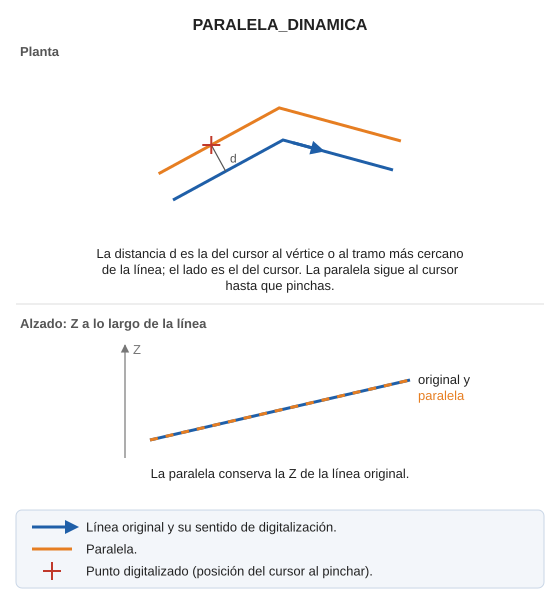

# PARALELA\_DINÁMICA
<!-- id: paralela-dinamica -->

Dibuja una línea paralela a una entidad a la distancia que especifique el operador, nos irá mostrando cómo queda la paralela según movemos el cursor.

## Parámetros

Esta orden no admite parámetros, ya que la distancia a la que se va a generar la paralela se selecciona con un clic en la pantalla de dibujo.

## Observaciones

Las paralelas las va a generar con el código que esté activo en el momento de ejecutar la orden.

La distancia es la que hay entre el cursor y el vértice o el tramo más cercano de la línea original. La paralela conserva la Z de la línea original.

## Características de la orden

| Tipo de orden | [Orden interactiva](paralela-dinamica.md) |
| :--- | :--- |
| Repite automáticamente | Si |
| Opción del menú donde aparece la orden | Dibujar/Más/Paralela dinámica en XY |
| Barra de herramientas en la que aparece la orden | Paralela |
| Extensión | DigiNG.OrdenesStandard.dll |
| Variables relacionadas | [REPITE](/digi3d-ai/referencia/ventana-de-dibujo/variables/r/repite.md) — repite la última orden ejecutada |
| Órdenes relacionadas | [PARALELA](/digi3d-ai/referencia/ventana-de-dibujo/ordenes/p/paralela.md) [PARALELA\_DINAMICA\_CON\_EJE](/digi3d-ai/referencia/ventana-de-dibujo/ordenes/p/paralela-dinamica-con-eje.md) [PARALELA\_DINAMICA\_PLANO\_DIBUJO](/digi3d-ai/referencia/ventana-de-dibujo/ordenes/p/paralela-dinamica-plano-dibujo.md) [PARALELA\_DINÁMICA\_XYZ](/digi3d-ai/referencia/ventana-de-dibujo/ordenes/p/paralela-dinamica-xyz.md) [PARALELA\_DINÁMICA\_Z\_FIJA](/digi3d-ai/referencia/ventana-de-dibujo/ordenes/p/paralela-dinamica-z-fija.md) |
| Nombre interno | {78C231A3-A299-4368-8B5F-C72A3FB9109B} |

