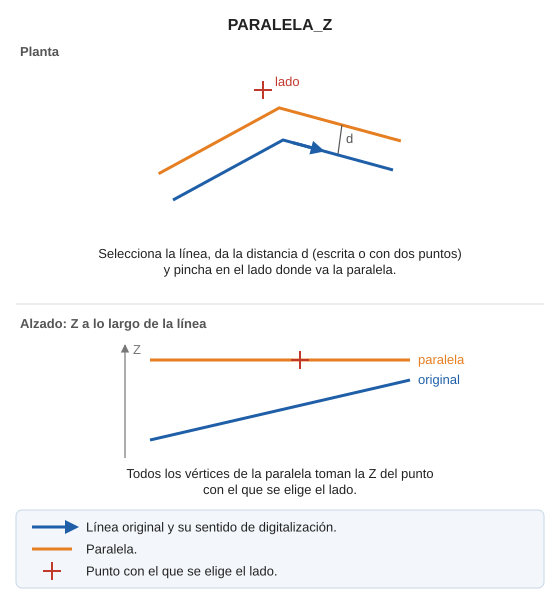

# PARALELA\_Z
<!-- id: paralela-z -->

Dibuja una paralela a una línea existente asignando la Z del punto digitalizado a todos los vértices de la paralela generada.

## Parámetros

No admite parámetros.

## Observaciones

Funciona como [PARALELA](/digi3d-ai/referencia/ventana-de-dibujo/ordenes/p/paralela.md): seleccionas la línea, das la distancia y pinchas en el lado. La diferencia es que todos los vértices de la paralela toman la Z del punto con el que eliges el lado.

## Características de la orden

| Tipo de orden | [Orden interactiva](paralela-z.md) |
| :--- | :--- |
| Repite automáticamente | No |
| Opción del menú donde aparece la orden | Dibujar/Más/Paralela clásica (selección/distancia/lado) con Z activa |
| Barra de herramientas en la que aparece la orden | _Esta orden no tiene asociado ningún botón en ninguna barra de herramientas_ |
| Extensión | DigiNG.OrdenesStandard.dll |
| Variables relacionadas | [DA](/digi3d-ai/referencia/ventana-de-dibujo/variables/d/da.md) — distancia activa [REPITE](/digi3d-ai/referencia/ventana-de-dibujo/variables/r/repite.md) — repite la última orden ejecutada |
| Órdenes relacionadas | [PARALELA](/digi3d-ai/referencia/ventana-de-dibujo/ordenes/p/paralela.md) [PARALELA\_DA](/digi3d-ai/referencia/ventana-de-dibujo/ordenes/p/paralela-da.md) |
| Nombre interno | {351A5010-8CDA-4DDA-AB3A-A0DA6E9631EE} |
