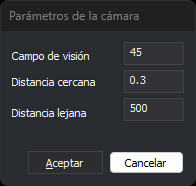

# PARAMETROS\_CAMARA\_CONICA
<!-- id: parametros-camara-conica -->

Asigna el campo de visión y las distancias de los planos de recorte de la cámara cónica de la ventana de dibujo.

## Parámetros

| Número de parámetro | Descripción | Opcional |
| :--- | :--- | :--- |
| 1 | Campo de visión vertical, en grados sexagesimales. Tiene que ser mayor que 0 y menor que 180. Valor por defecto: 45 | Si |
| 2 | Distancia del plano de recorte cercano, en las unidades de las coordenadas del dibujo. Tiene que ser mayor que 0 y menor que la distancia lejana. Valor por defecto: 0,3 | Si |
| 3 | Distancia del plano de recorte lejano, en las unidades de las coordenadas del dibujo. Tiene que ser mayor que la distancia cercana. Valor por defecto: 500 | Si |

Los parámetros usan el punto como separador decimal.

## Observaciones

La cámara cónica solo dibuja las entidades que están entre el plano de recorte cercano y el lejano, medidos desde la posición de la cámara en la dirección en la que mira.

Si indicas los tres parámetros, la orden no muestra el cuadro de diálogo: comprueba los valores, los guarda y termina. Si un parámetro no es un número, o los valores no cumplen las condiciones de la tabla de parámetros, la orden muestra un mensaje de error y no guarda nada. La orden ignora los parámetros a partir del cuarto.

Si indicas uno o dos parámetros, o ninguno, la orden muestra el cuadro de diálogo. Los campos del cuadro muestran los parámetros indicados y, para los que faltan, los últimos valores guardados.

La orden guarda los tres valores en los valores `Fov`, `NearDist` y `FarDist` de la clave del registro `HKEY_CURRENT_USER\Software\Digi21\Digi3D.NET\DigiNG\Configuration`. Los valores guardados se conservan para las siguientes sesiones.

Si la cámara de la ventana de dibujo es cónica, la orden aplica los valores a la cámara y regenera la vista. Si la cámara es ortogonal, la orden solo guarda los valores, y la orden [CAMARA\_CONICA](/digi3d-ai/referencia/ventana-de-dibujo/ordenes/c/camara-conica.md) los aplica cuando activa la cámara cónica.

### Cuadro de diálogo

El cuadro _Parámetros de la cámara_ tiene tres campos:

- _Campo de visión (grados)_: el campo de visión vertical de la cámara, en grados sexagesimales.
- _Distancia cercana_: la distancia del plano de recorte cercano.
- _Distancia lejana_: la distancia del plano de recorte lejano.

Si pulsas _Aceptar_, el cuadro comprueba los valores. Si un campo no contiene un número, o los valores no cumplen las condiciones de la tabla de parámetros, el cuadro muestra un mensaje, sitúa el cursor en el campo que hay que corregir y sigue abierto sin guardar nada. Si los valores son válidos, la orden los guarda en el registro y los aplica a la cámara.

Si pulsas _Cancelar_, la orden termina sin guardar los valores ni modificar la cámara.

## Características de la orden

| Tipo de orden | Orden inmediata |
| :--- | :--- |
| Repite automáticamente | No |
| Opción del menú donde aparece la orden | _Esta orden no tiene asociada ninguna opción de menú_ |
| Barra de herramientas en la que aparece la orden | _Esta orden no tiene asociado ningún botón en ninguna barra de herramientas_ |
| Extensión | DigiNG.OrdenesStandard.dll |
| Variables relacionadas | No tiene variables relacionadas |
| Órdenes relacionadas | [CAMARA\_CONICA](/digi3d-ai/referencia/ventana-de-dibujo/ordenes/c/camara-conica.md) [CAMARA\_ORTOFONAL](/digi3d-ai/referencia/ventana-de-dibujo/ordenes/c/camara-ortofonal.md) |
| Nombre interno | {4E593400-6A19-45CE-9A70-75D311A0C09D} |
