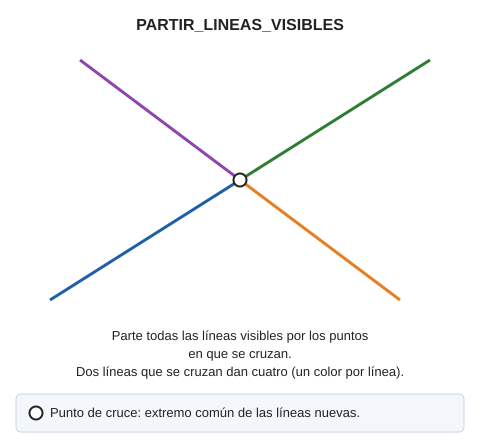

# PARTIR\_LINEAS\_VISIBLES
<!-- id: partir-lineas-visibles -->

Parte las entidades visibles por sus intersecciones.

## Parámetros

No admite parámetros.

## Características de la orden

| Tipo de orden | [Orden inmediata](partir-lineas-visibles.md) |
| :--- | :--- |
| Repite automáticamente | No |
| Opción del menú donde aparece la orden | Análisis geométricos/Partir líneas por el punto de cruce/Líneas visibles |
| Barra de herramientas en la que aparece la orden | _Esta orden no tiene asociado ningún botón en ninguna barra de herramientas_ |
| Extensión | DigiNG.OrdenesTopologia.dll |
| Variables relacionadas | No tiene variables relacionadas |
| Órdenes relacionadas | [DETECTAR\_CRUCE\_LINEAS\_VISIBLES](/digi3d-ai/referencia/ventana-de-dibujo/ordenes/d/detectar-cruce-lineas-visibles.md) [INSERTAR\_VERTICE\_INTERSECCION\_LINEAS\_VISIBLES](/digi3d-ai/referencia/ventana-de-dibujo/ordenes/i/insertar-vertice-interseccion-lineas-visibles.md) [PARTIR\_LINEAS](/digi3d-ai/referencia/ventana-de-dibujo/ordenes/p/partir-lineas.md) |
| Nombre interno | {E2D27EEC-E2B6-4147-9F19-FEC8DBAF1E15} |
