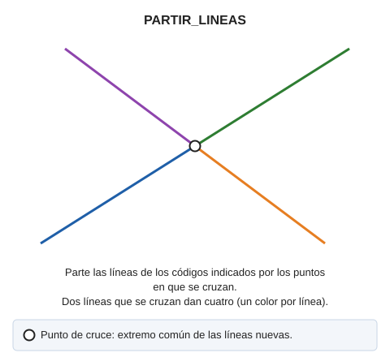

# PARTIR\_LINEAS

Parte las líneas en sus intersecciones por código.

## Parámetros

| Número de parámetro | Descripción | Opcional |
| :--- | :--- | :--- |
| 1 | Código o códigos (uno o más, separados por espacios) | Si |

## Características de la orden

| Tipo de orden | [Orden inmediata](partir-lineas.md) |
| :--- | :--- |
| Repite automáticamente | No |
| Opción del menú donde aparece la orden | _Esta orden no tiene asociada ninguna opción de menú_ |
| Barra de herramientas en la que aparece la orden | _Esta orden no tiene asociado ningún botón en ninguna barra de herramientas_ |
| Extensión | DigiNG.OrdenesTopologia.dll |
| Variables relacionadas | No tiene variables relacionadas |
| Órdenes relacionadas | [DETECTAR\_CRUCE\_LINEAS](/digi3d-ai/referencia/ventana-de-dibujo/ordenes/d/detectar-cruce-lineas.md) [INSERTAR\_VERTICE\_INTERSECCION\_LINEAS](/digi3d-ai/referencia/ventana-de-dibujo/ordenes/i/insertar-vertice-interseccion-lineas.md) [PARTIR\_LINEAS\_VISIBLES](/digi3d-ai/referencia/ventana-de-dibujo/ordenes/p/partir-lineas-visibles.md) |
| Nombre interno | {8D436538-8C23-410B-B64F-288EF7F48849} |
