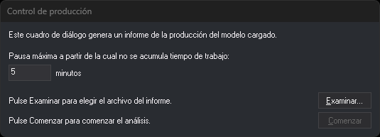

# PRODUCCION
<!-- id: produccion -->

Permite generar un fichero con la información acerca de la producción del archivo de dibujo abierto en ese momento.

## Parámetros

No admite parámetros.

## Cuadro de diálogo Control de producción

Esta orden solicita en este cuadro de diálogo:

* **Pausa máxima**: en minutos (valor por defecto: 5). El valor se recuerda para la próxima vez.
* **Examinar...**: elige el archivo HTML del informe. El botón **Comenzar** se habilita después de elegirlo.

## Observaciones

La orden calcula la producción a partir de la fecha y hora de creación de las líneas no borradas del archivo de dibujo. Las demás entidades no se tienen en cuenta. Dos líneas consecutivas del mismo día separadas por menos de la pausa máxima cuentan como tiempo de trabajo.

El informe contiene la fecha de la primera y la última línea, el tiempo total de trabajo y, para cada día, los intervalos de trabajo y de pausa. Al terminar, la orden abre el archivo HTML con la aplicación asociada. Si no se puede crear el archivo HTML, la orden muestra un mensaje de error y termina.

## Características de la orden

| Tipo de orden | [Orden inmediata](produccion.md) |
| :--- | :--- |
| Repite automáticamente | No |
| Opción del menú donde aparece la orden | _Esta orden no tiene asociada ninguna opción de menú_ |
| Barra de herramientas en la que aparece la orden | _Esta orden no tiene asociado ningún botón en ninguna barra de herramientas_ |
| Extensión | DigiNG.OrdenesControlTrabajos.dll |
| Variables relacionadas | No tiene variables relacionadas |
| Órdenes relacionadas | No tiene órdenes relacionadas |
| Nombre interno | {9A3109BC-561C-426B-9776-8925DD88E866} |
