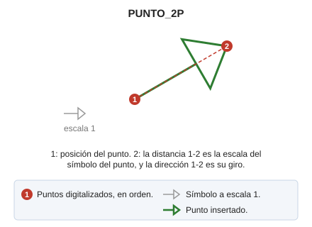

# PUNTO\_2P
<!-- id: punto-2p -->

Dibuja un punto en el archivo actual con la escala y rotación calculados con el segundo punto insertado.

## Parámetros

No admite parámetros.

## Observaciones

1. Digitaliza la posición del punto.
2. Digitaliza un segundo punto. La distancia entre los dos puntos es la escala del símbolo del punto, y la dirección del primero al segundo es su giro.

## Características de la orden

| Tipo de orden | [Orden inmediata](punto-2p.md) |
| :--- | :--- |
| Repite automáticamente | Si |
| Opción del menú donde aparece la orden | Dibujar/Punto escalado/rotado con dos puntos |
| Barra de herramientas en la que aparece la orden | Puntos |
| Extensión | DigiNG.OrdenesStandard.dll |
| Variables relacionadas | [REPITE](/digi3d-ai/referencia/ventana-de-dibujo/variables/r/repite.md) — repite la última orden ejecutada |
| Órdenes relacionadas | [PUNTO](/digi3d-ai/referencia/ventana-de-dibujo/ordenes/p/punto.md) [PUNTO\_R](/digi3d-ai/referencia/ventana-de-dibujo/ordenes/p/punto-r.md) |
| Nombre interno | {35AE7D6E-2A1D-4C67-873C-109C7D0F8394} |
