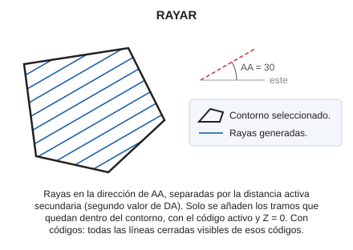

# RAYAR

Raya el interior de una entidad superficial de contorno cerrado.

## Parámetros

| Número de parámetro | Descripción | Opcional |
| :--- | :--- | :--- |
| 1 | Código o códigos (uno o más, separados por espacios) | Si |

Sin parámetros, la orden pide que selecciones la línea cerrada que se va a rayar. Con códigos, raya todas las líneas cerradas visibles de esos códigos y termina.

## Observaciones

Las rayas siguen la dirección del [ángulo activo](/digi3d-ai/referencia/ventana-de-dibujo/variables/a/aa.md) y están separadas por la distancia activa secundaria, que se asigna con el segundo parámetro de [DA](/digi3d-ai/referencia/ventana-de-dibujo/variables/d/da.md). Si DA se ejecuta con un solo valor, la secundaria es igual a la principal.

Solo se añaden los tramos de raya que quedan dentro del contorno. Las rayas se añaden con el código activo y con Z = 0.

## Características de la orden

| Tipo de orden | [Orden interactiva](rayar.md) |
| :--- | :--- |
| Repite automáticamente | Si |
| Opción del menú donde aparece la orden | Dibujar/Más/Rellenar polígono con rayas paralelas |
| Barra de herramientas en la que aparece la orden | _Esta orden no tiene asociado ningún botón en ninguna barra de herramientas_ |
| Extensión | DigiNG.OrdenesStandard.dll |
| Variables relacionadas | [AA](/digi3d-ai/referencia/ventana-de-dibujo/variables/a/aa.md) — ángulo activo [DA](/digi3d-ai/referencia/ventana-de-dibujo/variables/d/da.md) — distancia activa [REPITE](/digi3d-ai/referencia/ventana-de-dibujo/variables/r/repite.md) — repite la última orden ejecutada |
| Nombre interno | {91CEE0AF-E015-4d1e-A414-9250FAD17CCC} |

