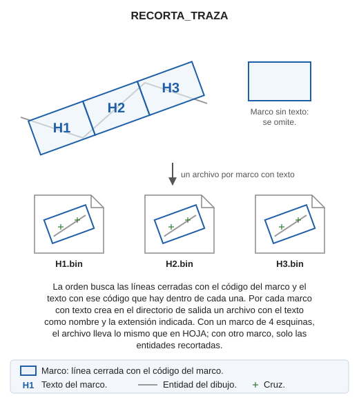
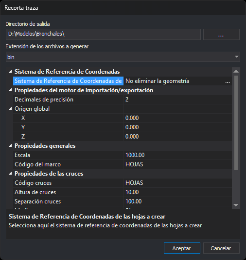

# RECORTA\_TRAZA
<!-- id: recorta-traza -->

Crea un archivo de dibujo por cada marco de un gráfico de hojas, como los que crea [TRAZA](/digi3d-ai/referencia/ventana-de-dibujo/ordenes/t/traza.md). El nombre de cada archivo es el texto que hay dentro del marco.

## Parámetros

Sin parámetros, la orden muestra el cuadro de diálogo _Recorta traza_. Con parámetros, la orden no muestra el cuadro y necesita como mínimo estos 12, en este orden:

| Número de parámetro | Descripción | Valores |
| :--- | :--- | :--- |
| 1 | Directorio de salida | Directorio existente en el que se crean los archivos |
| 2 | Extensión de los archivos a generar | Extensión de un formato que Digi3D.AI puede escribir, sin punto, por ejemplo `bin` |
| 3 | Parámetros del formato | Los parámetros del formato de la extensión indicada, entre comillas. Para `bin`: precisión, origen global X, origen global Y y origen global Z |
| 4 | Escala | Número mayor que 0 |
| 5 | Código del marco | Código de los marcos y de los textos con el nombre de cada hoja |
| 6 | Código de las cruces | Código |
| 7 | Altura de las cruces | mm de papel |
| 8 | Separación de las cruces | mm de papel, mayor que 0 |
| 9 | Medias cruces | 1 para añadirlas, 0 para no añadirlas |
| 10 | Código de las coordenadas | Código de los rótulos de coordenadas |
| 11 | Altura de las coordenadas | mm de papel |
| 12 | Número de decimales de las coordenadas | Número entero |

Formato:

RECORTA\_TRAZA=\[directorio de salida\] \[extensión\] \[parámetros del formato\] \[escala\] \[código del marco\] \[código de las cruces\] \[altura de las cruces\] \[separación de las cruces\] \[medias cruces\] \[código de las coordenadas\] \[altura de las coordenadas\] \[número de decimales\]

Los parámetros del formato cuentan como un único parámetro de la orden, así que van entre comillas. En el formato `bin`, la precisión es el número de decimales con el que se guardan las coordenadas: 2 para centímetros y 3 para milímetros.

### Ejemplo

`RECORTA_TRAZA="c:\trabajo\x" bin "2 0.0 0.0 0.0" 1000 HOJAS HOJAS 10 100 1 HOJAS 2 2`

Con parámetros, la orden muestra un mensaje de error y termina sin crear nada en estos casos:

* Hay menos de 12 parámetros.
* El directorio de salida no existe.
* La escala o la separación de las cruces no son mayores que 0.
* Ningún formato que Digi3D.AI puede escribir tiene la extensión indicada, o ese formato no tiene parámetros.
* El formato no reconoce los parámetros del formato. El mensaje muestra el formato que espera.

Con parámetros, el sistema de referencia de coordenadas de las hojas es el de la ventana de dibujo.

## Observaciones

### Marcos y nombres de las hojas

La orden busca en el archivo de dibujo activo:

* Los marcos: líneas cerradas que tienen el código del marco, que son visibles y que están en la zona de interés.
* Los textos que tienen el código del marco. Cada marco toma el primer texto, en el orden del archivo, cuyo punto de inserción está dentro del marco o sobre su borde. Cada texto da nombre a un solo marco.

La orden omite los marcos sin texto y los marcos cuyo texto está vacío. Si no encuentra ningún marco, la orden muestra el aviso _No se ha localizado ninguna línea de marco de hoja._, emite el sonido de error y termina.

Por cada marco con texto, la orden crea en el directorio de salida el archivo `<texto>.<extensión>`: con el texto `H1` y la extensión `bin`, el archivo `H1.bin`. Si el archivo ya existe, la orden lo sobrescribe sin pedir confirmación. Si dos marcos tienen el mismo texto, el archivo del segundo sustituye al del primero.

Mientras trabaja, la línea de órdenes muestra _Creando la hoja: \<archivo\>..._ para cada hoja.

### Contenido de cada archivo

El contenido depende del número de vértices del marco.

**Marco de 5 vértices** (4 esquinas y el cierre, como los de TRAZA): la orden crea la hoja igual que [HOJA](/digi3d-ai/referencia/ventana-de-dibujo/ordenes/h/hoja.md), con los vértices 1, 2, 3 y 4 del marco como esquinas inferior izquierda, inferior derecha, superior derecha y superior izquierda:

* el marco, con el código del marco;
* las cruces, las medias cruces y los rótulos de coordenadas, con los valores de las propiedades de las cruces y de las coordenadas;
* las entidades recortadas por el marco;
* junto al archivo, un archivo con la extensión `.utm` con las coordenadas de las 4 esquinas. Si no se puede crear, el panel de tareas muestra el error y la hoja se crea igualmente.

Las cruces, las medias cruces y los rótulos siguen los ejes X e Y. En un marco de TRAZA girado, el marco sigue el eje, pero las marcas no se giran.

**Marco con otro número de vértices**: el archivo solo contiene las entidades recortadas por el marco, sin marco, cruces, rótulos ni archivo `.utm`. La escala y las propiedades de las cruces y de las coordenadas no se usan.

Las entidades recortadas son las de los archivos de dibujo cargados que son visibles y están en la zona de interés, sin los códigos apagados:

* Las líneas, recortadas por el marco: se copian los trozos interiores.
* Los puntos y los textos cuyo punto de inserción está dentro del marco.
* Los polígonos, los elementos complejos, los multipuntos y las imágenes que quedan enteros dentro del marco. Los que cruzan el marco no se copian.

La orden no modifica el archivo de dibujo, así que no hay nada que deshacer. Los archivos creados no se abren.

### Errores al crear una hoja

Si no se puede crear el archivo de una hoja, por ejemplo porque el texto contiene caracteres que no son válidos en un nombre de archivo o porque el archivo está bloqueado por otro programa, la orden añade al panel de tareas un error _Error al crear la hoja_ con el nombre del archivo y la causa, y sigue con la hoja siguiente. Si alguna hoja falla, la orden termina con el sonido de error. Si todas se crean, la línea de órdenes muestra _Trabajo finalizado satisfactoriamente._

## Cuadro de diálogo Recorta traza

* **Directorio de salida**: directorio en el que se crean los archivos. El botón **...** abre el cuadro de selección de carpeta. El valor inicial es el directorio del archivo de dibujo activo.
* **Extensión de los archivos a generar**: formato de los archivos. La lista contiene las extensiones de los formatos que Digi3D.AI puede escribir.
* **Sistema de Referencia de Coordenadas**
  * **Sistema de Referencia de Coordenadas de las hojas a crear**: sistema de referencia de coordenadas que la orden asigna a cada archivo. El valor inicial es el de la ventana de dibujo. Si es un sistema local, la fila muestra _Desconocido_. El botón **...** abre el cuadro de selección de sistema de referencia de coordenadas. En el formato `bin` el sistema se guarda en un archivo `.prj` junto a cada hoja; si ese `.prj` ya existe, el formato conserva el sistema que contiene.
* **Propiedades del motor de importación/exportación**: parámetros del formato elegido. Cambian al cambiar la extensión. En el formato `bin`: **Decimales de precisión** y **Origen global** X, Y y Z.
* **Propiedades generales**
  * **Escala**: escala de las hojas. Se puede escribir o elegir de la lista. Tiene que ser mayor que 0.
  * **Código del marco**: código de los marcos y de los textos que la orden busca, y código del marco que escribe en cada hoja de 5 vértices.
* **Propiedades de las cruces**
  * **Código cruces**: código de las cruces y de las medias cruces.
  * **Altura de cruces**: longitud de cada trazo de la cruz, en mm de papel.
  * **Separación cruces**: distancia entre cruces, en mm de papel. Tiene que ser mayor que 0.
  * **Medias cruces**: añade medias cruces y rótulos en el borde del marco.
* **Propiedades de las coordenadas**
  * **Código coordenadas**: código de los rótulos de coordenadas.
  * **Altura de coordenadas**: altura de los rótulos, en mm de papel.
  * **Nº decimales**: decimales de los rótulos de las esquinas y, sin medias cruces, de todos los rótulos.

Los valores de papel equivalen en el terreno a valor × escala ÷ 1000: con escala 1000 y separación 100, las cruces se colocan cada 100 m.

Si pulsas **Aceptar**, el cuadro comprueba los valores. Si el directorio de salida no existe, si la escala o la separación de las cruces no son mayores que 0, o si el formato elegido no tiene parámetros, el cuadro muestra un mensaje y sigue abierto sin guardar nada. Si los valores son válidos, la orden guarda la extensión y las propiedades generales, de las cruces y de las coordenadas en la clave del registro `HKEY_CURRENT_USER\Software\Digi21\Digi3D.NET\DigiNG\Extensiones\DigiNG.OrdenesStandard\RecortarTraza` y crea las hojas. La siguiente vez que ejecutes la orden, el cuadro muestra esos valores. El directorio de salida, el sistema de referencia de coordenadas y los parámetros del formato no se guardan.

La primera vez, la extensión es la segunda de la lista; la escala es la configurada en Digi3D.AI o 1000; la altura de cruces 10; la separación 100; la altura de coordenadas 2; los códigos `HOJAS`; las medias cruces activadas y 2 decimales.

Si pulsas **Cancelar**, la orden termina sin crear nada ni guardar los valores.

## Características de la orden

| Tipo de orden | [Orden interactiva](/digi3d-ai/referencia/ventana-de-dibujo/ordenes-interactivas.md) |
| :--- | :--- |
| Repite automáticamente | No |
| Opción del menú donde aparece la orden | Dibujar/Gráfico de hojas/Crear hojas a partir de gráfico de hojas |
| Barra de herramientas en la que aparece la orden | _Esta orden no tiene asociado ningún botón en ninguna barra de herramientas_ |
| Extensión | DigiNG.OrdenesStandard.dll |
| Variables relacionadas | No tiene variables relacionadas |
| Órdenes relacionadas | [HOJA](/digi3d-ai/referencia/ventana-de-dibujo/ordenes/h/hoja.md) [TRAZA](/digi3d-ai/referencia/ventana-de-dibujo/ordenes/t/traza.md) |
| Nombre interno | {B066D261-DFE7-4c27-AFAC-CECD7B76D3C2} |
